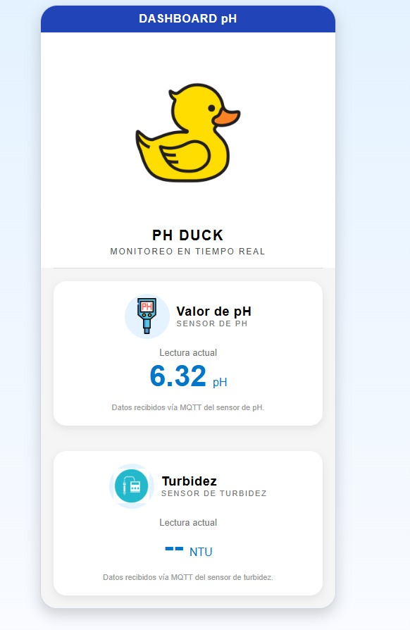

# Proyecto final
 Entrega final, donde se presentó el proyecto de **"Citizen Quack"** como un producto terminado y en su proceso 

## Proyecto terminado 

Imagen del proyecto final terminado 
{ width="600" align=center}

## App Móvil 

Imagen mostrando el funcionamiento de la app de medición, enseñando su diseño, datos y variables

{ width="600" align=center}

## Documento de entrega final

[Descargar especificación (PDF)](\REC\Entrega_final_Proyectos_4.pdf)

<object data="../REC/Archivos/Entrega_final_Proyectos_4.pdf" type="application/pdf" width="100%" height="600">
  
No se pudo mostrar el PDF. <a href="../REC/Archivos/Entrega_final_Proyectos_4.pdf">Descargar</a>

</object>

## Presentación final
Presentación final usada para el pitch de ventas de la clase final en el cual mostramos y hablamos sobre nuestro producto **"Citizen Quack"**, tocando puntos clave como su mercado, costos generales, plan de negocios e inversión inicial del proyecto.

[Descargar especificación (PDF)](\REC\presentacion_proyectos.pdf)

<object data="../REC/Archivos/presentacion_proyectos.pdf" type="application/pdf" width="100%" height="600">
  
No se pudo mostrar el PDF. <a href="../REC/Archivos/presentacion_proyectos.pdf">Descargar</a>

</object>

