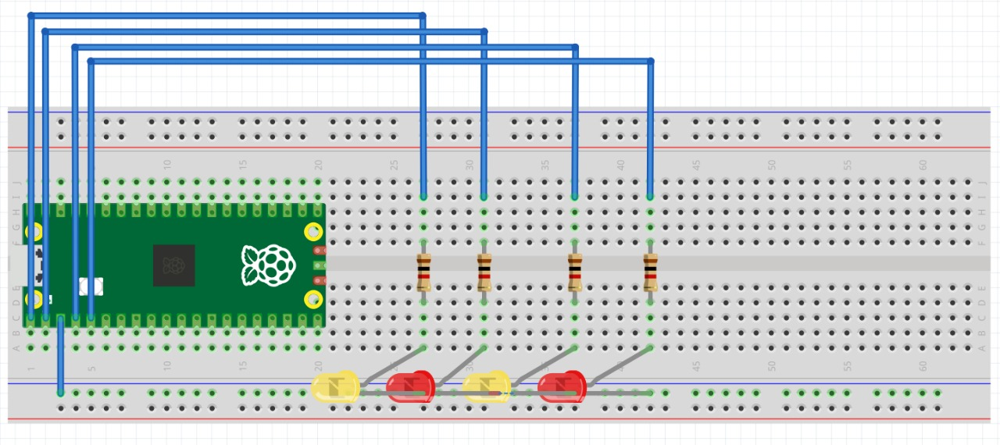
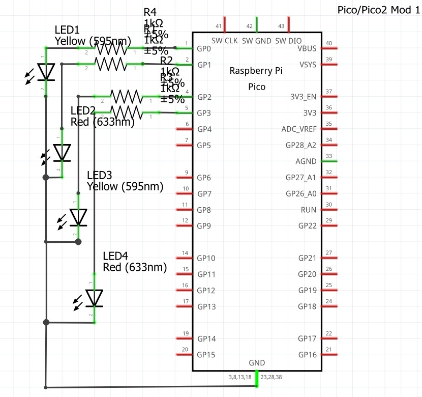
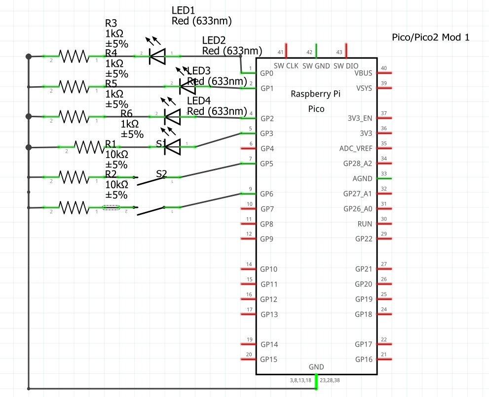
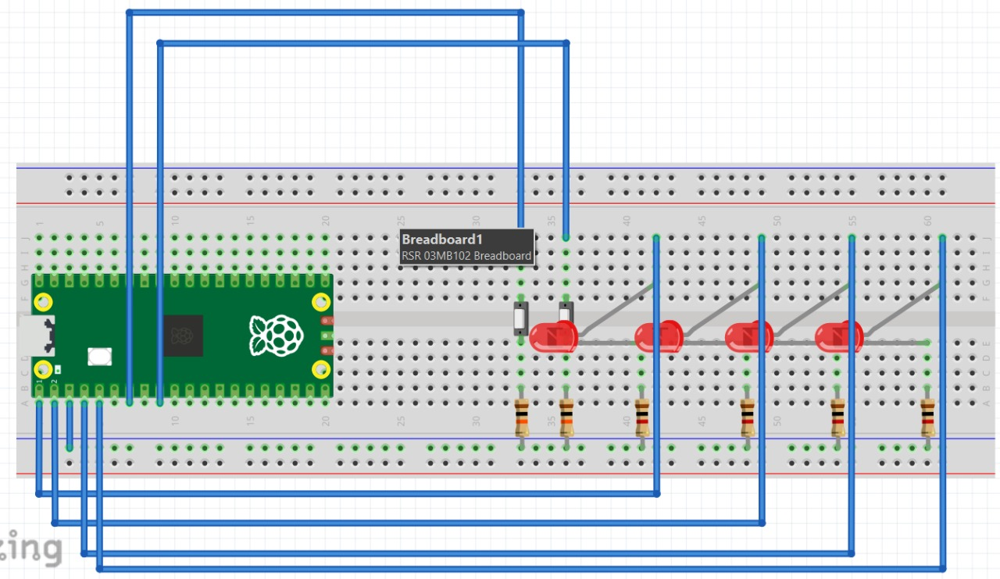

# Tareas
## Tarea 1: Comparativa de Microcontroladores

El objetivo de esta tarea es familiarizarnos con los diferentes tipos de microcontroladores y sus características para así poder elegir el ideal para nuestros futuros proyectos.

### Proyecto elegido 

La comparación será en base a un proyecto el cual es un coche autonomo que tiene sensores para poder moverse libremente y así saber si tiene un obstáculo que le impida su movimiento.

### Tabla comparativa
| Variables\Microcontrolador | ATmega328P (Arduino Uno) | STM32F103C8T6 | PIC18F4550 | RP2040 (Raspberry Pi Pico) |
|---------------------------|-------------------------|---------------------------|------------|---------------------------|
| **Periféricos**           | 23 I/O, ADC(6), UART, SPI, I²C, PWM(6) | 37 GPIO, ADC, DAC, UART, SPI, I²C, CAN, USB | 35 I/O, ADC(10), UART, SPI, I²C, USB 2.0, PWM | 26 GPIO, ADC(4), UART, SPI, I²C, PWM, PIO |
| **Memoria (Flash/RAM/EEPROM)** | 32 KB / 2 KB / 1 KB | 64 KB / 20 KB / — | 32 KB / 2 KB / 256 B | 2 MB ext. / 264 KB / — |
| **Ecosistema**             | Arduino IDE | STM32CubeIDE, Arduino, PlatformIO | MPLAB X, XC8 Compiler | SDK C/C++, MicroPython, Arduino Core |
| **Costo aprox**     | $150 – $220 | $90 – $180 | $240 – $290 | $100 – $200 |
| **Arquitectura**           | AVR 8 bits | ARM Cortex-M3 32 bits | PIC 8 bits | ARM Cortex-M0+ Dual-core 32 bits |
| **Velocidad de trabajo**   | 16 MHz | 72 MHz | 48 MHz | 133 MHz |

### Conclusiones

1. STM32F103: Muy buen balance de rendimiento en tiempo real, muchos timers/PWM, captura de entradas para encoders, ADC 12-bit rápido, CAN/USB en variantes. Excelente para control PID a alta tasa y fusión básica de sensores.

2. RP2040: Mucha RAM (264 KB), dos núcleos, y PIO para decodificar encoders o protocolos con poca CPU. Ecosistema enorme (SDK C/C++, MicroPython, Arduino).

3. ATmega328P Ecosistema y librerías accesibles, PWM/ADC suficientes para un proyecto básico, gran comunidad y más familiarización con el, pero una CPU lenta, poca RAM/Flash; se queda corto si aumentan sensores/encoders y la tasa de refresco.

4. PIC18F4550: Robusto e industrial; USB nativo. Menos poder efectivo (8-bit), ecosistema/herramientas menos ágiles para robótica, timers/ADC suficientes pero te quedarás antes que con STM32/RP2040.

## Tarea 2: Outputs Básicos
### Contador binario 4 bits
En cuatro leds debe mostrarse cad segundo la representacion binaria del 0 al 15

#### Código

```bash
#include "pico/stdlib.h"

#define LEDS_MASK ((1<<0) | (1<<1) | (1<<3) | (1<<4))   
int main() {
    stdio_init_all();
 
    gpio_init(0); gpio_set_dir(0, GPIO_OUT);
    gpio_init(1); gpio_set_dir(1, GPIO_OUT);
    gpio_init(3); gpio_set_dir(3, GPIO_OUT);
    gpio_init(4); gpio_set_dir(4, GPIO_OUT);
 
    int estado = 0;
 
    while (1) {
        for (estado = 0; estado < 16; estado++) {
            gpio_put(0, estado & (1<<0));
            gpio_put(1, estado & (1<<1));
            gpio_put(3, estado & (1<<2));  
            gpio_put(4, estado & (1<<3));
            sleep_ms(500);
        }
    }
}

```
#### Diagrama del circuito

{ width="600" align=center}

{ width="600" align=center}

#### Video

<iframe width="560" height="315"
src="https://www.youtube.com/embed/WPuGgSJhCBk"
title="YouTube video player"
frameborder="0"
allow="accelerometer; autoplay; clipboard-write; encrypted-media; gyroscope; picture-in-picture; web-share"
allowfullscreen>
</iframe>

### Barrido de leds
Correr un “1” por cinco LEDs P0..P3 y regresar (0→1→2→3→2→1…)

#### Código

```bash
#include "pico/stdlib.h"
 
#define LED0 0  
#define LED1 1  
#define LED2 3  
#define LED3 4  
 
#define LED_MASK ((1u << LED0) | (1u << LED1) | (1u << LED2) | (1u << LED3))
 
const uint LEDS[4] = {LED0, LED1, LED2, LED3}; // lo hice así para no repetir 4 lineas de código
 
int main() {
    for (int i = 0; i < 4; i++) {
        gpio_init(LEDS[i]);
        gpio_set_dir(LEDS[i], true);
    }
 
    int posicion = 0;
    int dir = 1;  
 
    while (true) {
        gpio_clr_mask(LED_MASK); 
 
        uint32_t bit = (1u << LEDS[posicion]);
        gpio_set_mask(bit);      
 
        sleep_ms(300);
 
        posicion += dir;
 
        if (posicion == 4 || posicion == -1) {
            gpio_clr_mask(LED_MASK);
            dir = -dir;  
        }
    }
}
```

#### Diagrama del sistema

{ width="600" align=center}

{ width="600" align=center}

#### Video

<iframe width="560" height="315"
src="https://www.youtube.com/embed/y7T2UWbOsAI"
title="YouTube video player"
frameborder="0"
allow="accelerometer; autoplay; clipboard-write; encrypted-media; gyroscope; picture-in-picture; web-share"
allowfullscreen>
</iframe>

### Secuencia en codigo Gray

Transformar código binario en una secuencia en código Gray

#### Código

```bash
#include "pico/stdlib.h"
 
int main() {
 
    const uint LEDS[] = {0, 1, 3, 4};
    const int Cantidad = 4;
 
   
    for (int i = 0; i < Cantidad; i++) {//Para evitar código si son muchos pines
        gpio_init(LEDS[i]);
        gpio_set_dir(LEDS[i], GPIO_OUT);
    }
 
    while (true) {
       
        for (int n = 0; n < 16; n++) {
            int gray = n ^ (n >> 1); // Fórmula para convertir a Gray
 
           
            for (int i = 0; i < Cantidad; i++) {
                int bit = (gray >> i) & 1;
                gpio_put(LEDS[i], bit);
            }
 
            sleep_ms(500);
        }
    }
}
```
#### Diagrama del circuito

{ width="600" align=center}

{ width="600" align=center}

#### Video

<iframe width="560" height="315"
src="https://www.youtube.com/embed/dRX9EdW8nDc"
title="YouTube video player"
frameborder="0"
allow="accelerometer; autoplay; clipboard-write; encrypted-media; gyroscope; picture-in-picture; web-share"
allowfullscreen>
</iframe>

## Tarea 3: Inputs

### Compuertas básicas AND / OR / XOR con 2 botones
**Qué debe hacer:** Con dos botones A y B enciende tres LEDs que muestren en paralelo los resultados de AND, OR y XOR. 

#### Código

```bash
#include "pico/stdlib.h"
#include "hardware/gpio.h"
 
#define LED   0
#define LED2    1
#define LED3   3
 
#define Boton1   5
#define Boton2   6
 
int main() {
 
    gpio_init(LED);
    gpio_set_dir(LED, true);
 
    gpio_init(LED2);
    gpio_set_dir(LED2, true);
 
    gpio_init(LED3);
    gpio_set_dir(LED3, true);
 
    gpio_init(Boton1);
    gpio_set_dir(Boton1, false);
    gpio_pull_up(Boton1);
 
    gpio_init(Boton2);
    gpio_set_dir(Boton2, false);
    gpio_pull_up(Boton2);
 
    while (true) {
        // Se invierte para que sea Pull-up
        uint32_t b1 = !gpio_get(Boton1);
        uint32_t b2 = !gpio_get(Boton2);
 
        uint32_t AND = b1 & b2;   
        uint32_t OR  = b1 | b2; 
        uint32_t XOR = b1 ^ b2;
 
        gpio_clr_mask((1u << LED) | (1u << LED2) | (1u << LED3));
        gpio_set_mask((AND << LED) |
                      (OR  << LED2)  |
                      (XOR << LED3));
    }
}

```
#### Diagrama del circuito

{ width="600" align=center}

{ width="600" align=center}

#### Video

<iframe width="560" height="315"
src="https://www.youtube.com/embed/bSNO7ncCw5g"
title="YouTube video player"
frameborder="0"
allow="accelerometer; autoplay; clipboard-write; encrypted-media; gyroscope; picture-in-picture; web-share"
allowfullscreen>
</iframe>

### Selector cíclico de 4 LEDs con avance/retroceso

**Qué debe hacer:** Mantén un único LED encendido entre LED0..LED3. Un botón AVANZA (0→1→2→3→0) y otro RETROCEDE (0→3→2→1→0). Un push = un paso y si dejas presionado no repite. 

#### Código

```bash
#include "pico/stdlib.h"
 
#define LED0 0  
#define LED1 1  
#define LED2 3  
#define LED3 4  
 
#define Boton1 5
#define Boton2 6
 
#define LED_MASK ((1u << LED0) | (1u << LED1) | (1u << LED2) | (1u << LED3))
 
const uint LEDS[4] = {LED0, LED1, LED2, LED3};
 
int main() {
    stdio_init_all();
 
    for (int i = 0; i < 4; i++) {
        gpio_init(LEDS[i]);
        gpio_set_dir(LEDS[i], true);
    }
 
    gpio_init(Boton1);
    gpio_set_dir(Boton1, false);  
    gpio_pull_up(Boton1);
 
    gpio_init(Boton2);
    gpio_set_dir(Boton2, false);  
    gpio_pull_up(Boton2);
 
    int posicion = 0;
    uint32_t Estadob1 = true;
    uint32_t Estadob2 = true;
 
    while (true) {
        // Poner posición actual
        gpio_clr_mask(LED_MASK);
        gpio_set_mask(1u << LEDS[posicion]);
 
       
        uint32_t Avance = gpio_get(Boton1);
        uint32_t Retroceso = gpio_get(Boton2);
 
        if (!Avance && Estadob1) {
            posicion++;
            if (posicion > 3) posicion = 0;
        }
 
        if (!Retroceso && Estadob2) {
            posicion--;
            if (posicion < 0) posicion = 3;
        }
 
        Estadob1 = Avance;
        Estadob2 = Retroceso;
 
        sleep_ms(20);
    }
}
```

#### Diagrama del circuito

{ width="600" align=center}

{ width="600" align=center}

#### Video

<iframe width="560" height="315"
src="https://www.youtube.com/embed/tf33W2s8G6I"
title="YouTube video player"
frameborder="0"
allow="accelerometer; autoplay; clipboard-write; encrypted-media; gyroscope; picture-in-picture; web-share"
allowfullscreen>
</iframe>
