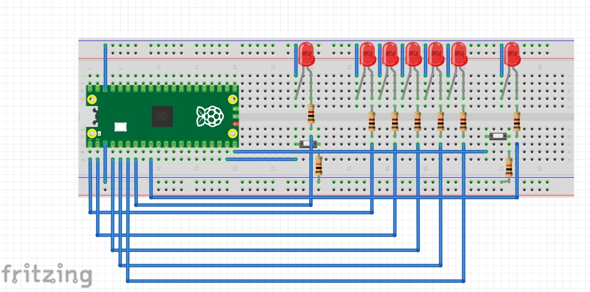
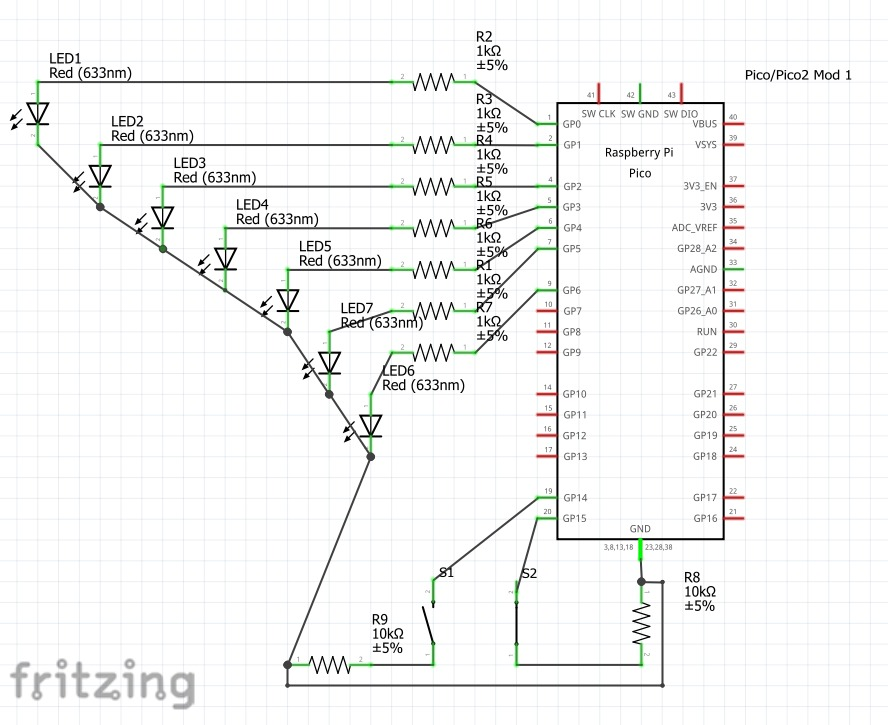
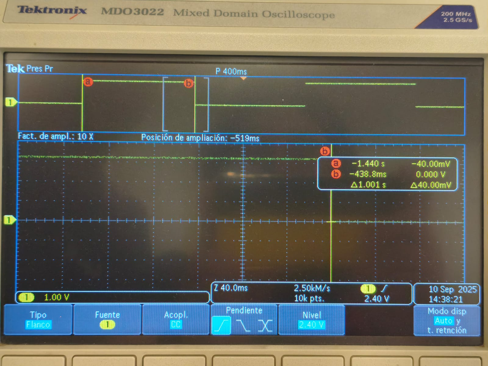
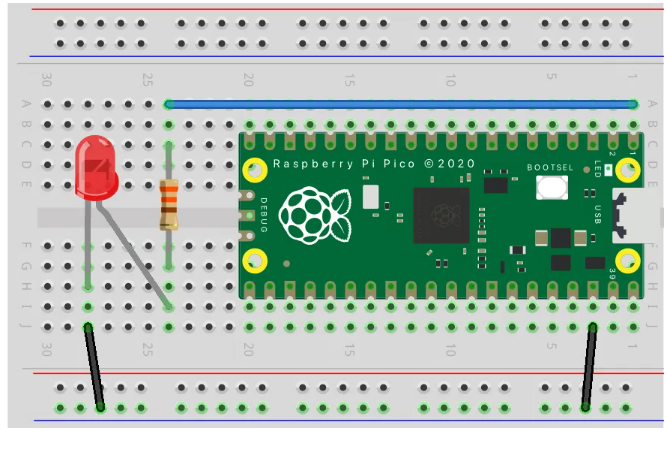
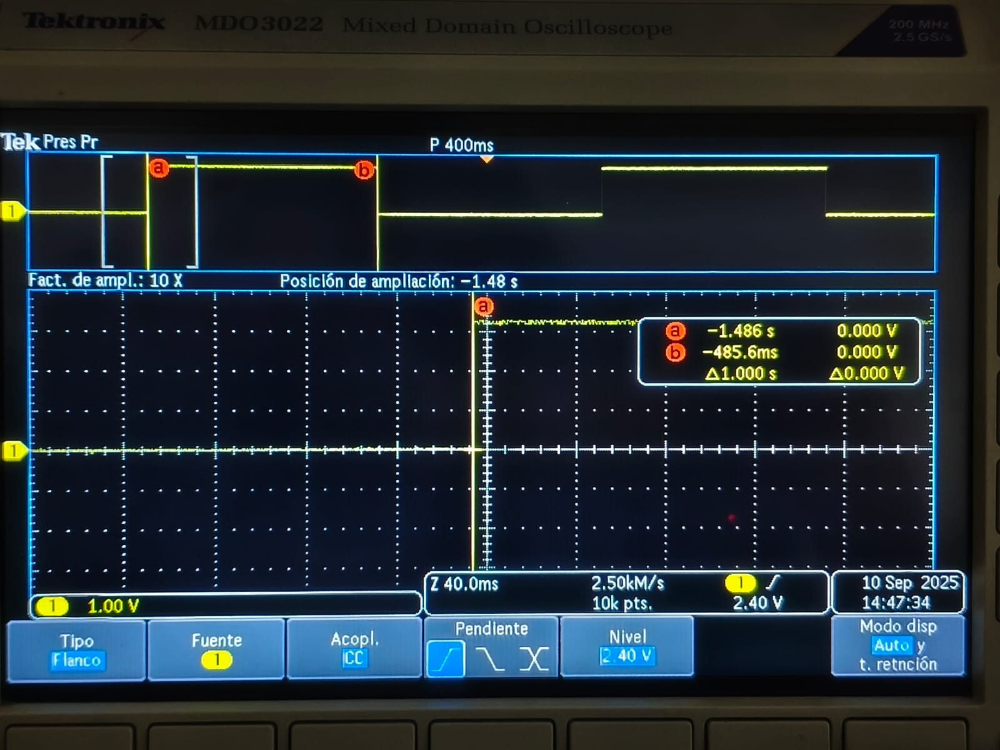
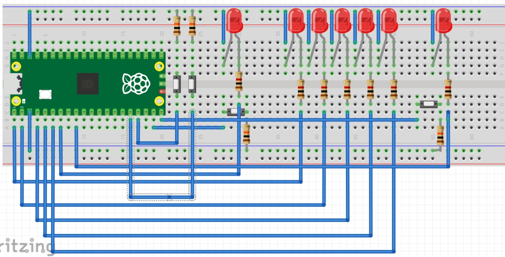
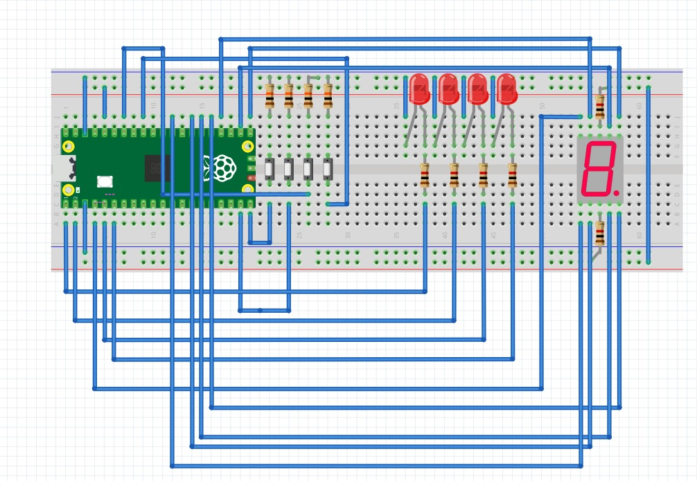
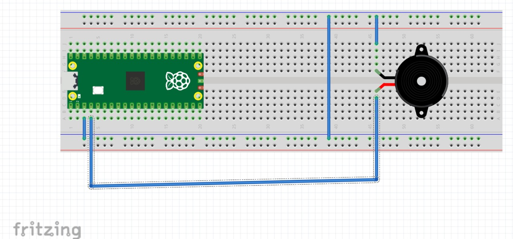
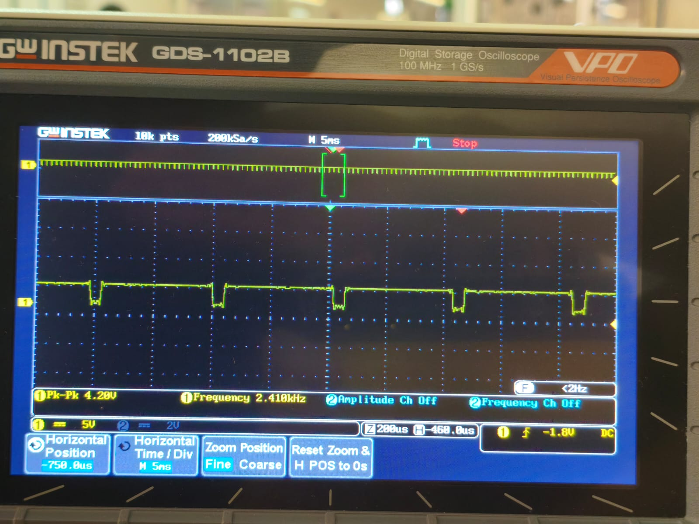
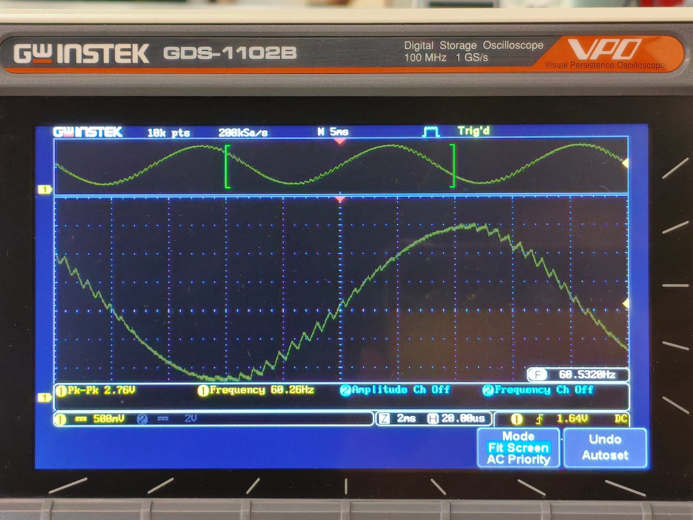

# Tareas
## Tarea 1: Comparativa de Microcontroladores

El objetivo de esta tarea es familiarizarnos con los diferentes tipos de microcontroladores y sus características para así poder elegir el ideal para nuestros futuros proyectos.

### Proyecto elegido 

La comparación será en base a un proyecto el cual es un coche autonomo que tiene sensores para poder moverse libremente y así saber si tiene un obstáculo que le impida su movimiento.

### Tabla comparativa
| Variables\Microcontrolador | ATmega328P (Arduino Uno) | STM32F103C8T6 | PIC18F4550 | RP2040 (Raspberry Pi Pico) |
|---------------------------|-------------------------|---------------------------|------------|---------------------------|
| **Periféricos**           | 23 I/O, ADC(6), UART, SPI, I²C, PWM(6) | 37 GPIO, ADC, DAC, UART, SPI, I²C, CAN, USB | 35 I/O, ADC(10), UART, SPI, I²C, USB 2.0, PWM | 26 GPIO, ADC(4), UART, SPI, I²C, PWM, PIO |
| **Memoria (Flash/RAM/EEPROM)** | 32 KB / 2 KB / 1 KB | 64 KB / 20 KB / — | 32 KB / 2 KB / 256 B | 2 MB ext. / 264 KB / — |
| **Ecosistema**             | Arduino IDE | STM32CubeIDE, Arduino, PlatformIO | MPLAB X, XC8 Compiler | SDK C/C++, MicroPython, Arduino Core |
| **Costo aprox**     | $150 – $220 | $90 – $180 | $240 – $290 | $100 – $200 |
| **Arquitectura**           | AVR 8 bits | ARM Cortex-M3 32 bits | PIC 8 bits | ARM Cortex-M0+ Dual-core 32 bits |
| **Velocidad de trabajo**   | 16 MHz | 72 MHz | 48 MHz | 133 MHz |

### Conclusiones

1. STM32F103: Muy buen balance de rendimiento en tiempo real, muchos timers/PWM, captura de entradas para encoders, ADC 12-bit rápido, CAN/USB en variantes. Excelente para control PID a alta tasa y fusión básica de sensores.

2. RP2040: Mucha RAM (264 KB), dos núcleos, y PIO para decodificar encoders o protocolos con poca CPU. Ecosistema enorme (SDK C/C++, MicroPython, Arduino).

3. ATmega328P Ecosistema y librerías accesibles, PWM/ADC suficientes para un proyecto básico, gran comunidad y más familiarización con el, pero una CPU lenta, poca RAM/Flash; se queda corto si aumentan sensores/encoders y la tasa de refresco.

4. PIC18F4550: Robusto e industrial; USB nativo. Menos poder efectivo (8-bit), ecosistema/herramientas menos ágiles para robótica, timers/ADC suficientes pero te quedarás antes que con STM32/RP2040.

## Tarea 2: Outputs Básicos
### Contador binario 4 bits
En cuatro leds debe mostrarse cad segundo la representacion binaria del 0 al 15

#### Código

```bash
#include "pico/stdlib.h"

#define LEDS_MASK ((1<<0) | (1<<1) | (1<<3) | (1<<4))   
int main() {
    stdio_init_all();
 
    gpio_init(0); gpio_set_dir(0, GPIO_OUT);
    gpio_init(1); gpio_set_dir(1, GPIO_OUT);
    gpio_init(3); gpio_set_dir(3, GPIO_OUT);
    gpio_init(4); gpio_set_dir(4, GPIO_OUT);
 
    int estado = 0;
 
    while (1) {
        for (estado = 0; estado < 16; estado++) {
            gpio_put(0, estado & (1<<0));
            gpio_put(1, estado & (1<<1));
            gpio_put(3, estado & (1<<2));  
            gpio_put(4, estado & (1<<3));
            sleep_ms(500);
        }
    }
}

```
#### Diagrama del circuito

{ width="600" align=center}

{ width="600" align=center}

#### Video

<iframe width="560" height="315"
src="https://www.youtube.com/embed/WPuGgSJhCBk"
title="YouTube video player"
frameborder="0"
allow="accelerometer; autoplay; clipboard-write; encrypted-media; gyroscope; picture-in-picture; web-share"
allowfullscreen>
</iframe>

### Barrido de leds
Correr un “1” por cinco LEDs P0..P3 y regresar (0→1→2→3→2→1…)

#### Código

```bash
#include "pico/stdlib.h"
 
#define LED0 0  
#define LED1 1  
#define LED2 3  
#define LED3 4  
 
#define LED_MASK ((1u << LED0) | (1u << LED1) | (1u << LED2) | (1u << LED3))
 
const uint LEDS[4] = {LED0, LED1, LED2, LED3}; // lo hice así para no repetir 4 lineas de código
 
int main() {
    for (int i = 0; i < 4; i++) {
        gpio_init(LEDS[i]);
        gpio_set_dir(LEDS[i], true);
    }
 
    int posicion = 0;
    int dir = 1;  
 
    while (true) {
        gpio_clr_mask(LED_MASK); 
 
        uint32_t bit = (1u << LEDS[posicion]);
        gpio_set_mask(bit);      
 
        sleep_ms(300);
 
        posicion += dir;
 
        if (posicion == 4 || posicion == -1) {
            gpio_clr_mask(LED_MASK);
            dir = -dir;  
        }
    }
}
```

#### Diagrama del sistema

{ width="600" align=center}

{ width="600" align=center}

#### Video

<iframe width="560" height="315"
src="https://www.youtube.com/embed/y7T2UWbOsAI"
title="YouTube video player"
frameborder="0"
allow="accelerometer; autoplay; clipboard-write; encrypted-media; gyroscope; picture-in-picture; web-share"
allowfullscreen>
</iframe>

### Secuencia en codigo Gray

Transformar código binario en una secuencia en código Gray

#### Código

```bash
#include "pico/stdlib.h"
 
int main() {
 
    const uint LEDS[] = {0, 1, 3, 4};
    const int Cantidad = 4;
 
   
    for (int i = 0; i < Cantidad; i++) {//Para evitar código si son muchos pines
        gpio_init(LEDS[i]);
        gpio_set_dir(LEDS[i], GPIO_OUT);
    }
 
    while (true) {
       
        for (int n = 0; n < 16; n++) {
            int gray = n ^ (n >> 1); // Fórmula para convertir a Gray
 
           
            for (int i = 0; i < Cantidad; i++) {
                int bit = (gray >> i) & 1;
                gpio_put(LEDS[i], bit);
            }
 
            sleep_ms(500);
        }
    }
}
```
#### Diagrama del circuito

{ width="600" align=center}

{ width="600" align=center}

#### Video

<iframe width="560" height="315"
src="https://www.youtube.com/embed/dRX9EdW8nDc"
title="YouTube video player"
frameborder="0"
allow="accelerometer; autoplay; clipboard-write; encrypted-media; gyroscope; picture-in-picture; web-share"
allowfullscreen>
</iframe>

## Tarea 3: Inputs

### Compuertas básicas AND / OR / XOR con 2 botones
**Qué debe hacer:** Con dos botones A y B enciende tres LEDs que muestren en paralelo los resultados de AND, OR y XOR. 

#### Código

```bash
#include "pico/stdlib.h"
#include "hardware/gpio.h"
 
#define LED   0
#define LED2    1
#define LED3   3
 
#define Boton1   5
#define Boton2   6
 
int main() {
 
    gpio_init(LED);
    gpio_set_dir(LED, true);
 
    gpio_init(LED2);
    gpio_set_dir(LED2, true);
 
    gpio_init(LED3);
    gpio_set_dir(LED3, true);
 
    gpio_init(Boton1);
    gpio_set_dir(Boton1, false);
    gpio_pull_up(Boton1);
 
    gpio_init(Boton2);
    gpio_set_dir(Boton2, false);
    gpio_pull_up(Boton2);
 
    while (true) {
        // Se invierte para que sea Pull-up
        uint32_t b1 = !gpio_get(Boton1);
        uint32_t b2 = !gpio_get(Boton2);
 
        uint32_t AND = b1 & b2;   
        uint32_t OR  = b1 | b2; 
        uint32_t XOR = b1 ^ b2;
 
        gpio_clr_mask((1u << LED) | (1u << LED2) | (1u << LED3));
        gpio_set_mask((AND << LED) |
                      (OR  << LED2)  |
                      (XOR << LED3));
    }
}

```
#### Diagrama del circuito

{ width="600" align=center}

{ width="600" align=center}

#### Video

<iframe width="560" height="315"
src="https://www.youtube.com/embed/bSNO7ncCw5g"
title="YouTube video player"
frameborder="0"
allow="accelerometer; autoplay; clipboard-write; encrypted-media; gyroscope; picture-in-picture; web-share"
allowfullscreen>
</iframe>

### Selector cíclico de 4 LEDs con avance/retroceso

**Qué debe hacer:** Mantén un único LED encendido entre LED0..LED3. Un botón AVANZA (0→1→2→3→0) y otro RETROCEDE (0→3→2→1→0). Un push = un paso y si dejas presionado no repite. 

#### Código

```bash
#include "pico/stdlib.h"
 
#define LED0 0  
#define LED1 1  
#define LED2 3  
#define LED3 4  
 
#define Boton1 5
#define Boton2 6
 
#define LED_MASK ((1u << LED0) | (1u << LED1) | (1u << LED2) | (1u << LED3))
 
const uint LEDS[4] = {LED0, LED1, LED2, LED3};
 
int main() {
    stdio_init_all();
 
    for (int i = 0; i < 4; i++) {
        gpio_init(LEDS[i]);
        gpio_set_dir(LEDS[i], true);
    }
 
    gpio_init(Boton1);
    gpio_set_dir(Boton1, false);  
    gpio_pull_up(Boton1);
 
    gpio_init(Boton2);
    gpio_set_dir(Boton2, false);  
    gpio_pull_up(Boton2);
 
    int posicion = 0;
    uint32_t Estadob1 = true;
    uint32_t Estadob2 = true;
 
    while (true) {
        // Poner posición actual
        gpio_clr_mask(LED_MASK);
        gpio_set_mask(1u << LEDS[posicion]);
 
       
        uint32_t Avance = gpio_get(Boton1);
        uint32_t Retroceso = gpio_get(Boton2);
 
        if (!Avance && Estadob1) {
            posicion++;
            if (posicion > 3) posicion = 0;
        }
 
        if (!Retroceso && Estadob2) {
            posicion--;
            if (posicion < 0) posicion = 3;
        }
 
        Estadob1 = Avance;
        Estadob2 = Retroceso;
 
        sleep_ms(20);
    }
}
```

#### Diagrama del circuito

{ width="600" align=center}

{ width="600" align=center}

#### Video

<iframe width="560" height="315"
src="https://www.youtube.com/embed/tf33W2s8G6I"
title="YouTube video player"
frameborder="0"
allow="accelerometer; autoplay; clipboard-write; encrypted-media; gyroscope; picture-in-picture; web-share"
allowfullscreen>
</iframe>

## Tarea 4: Ping-Pong

Programar un mini-Pong con 5 LEDs en línea y 2 botones usando interrupciones (ISR) para registrar el “golpe” del jugador exactamente cuando la “pelota” (un LED encendido) llega al extremo de su lado.

### Reglas del juego

1. Pelota: es un único LED encendido que se mueve automáticamente de un extremo al otro (L1→L5→L1…) a un ritmo fijo.

2. Golpe con ISR: cada botón genera una interrupción.

    * El BTN_L solo cuenta si, en el instante de la ISR, la pelota está en L1.

    * El BTN_R solo cuenta si, en el instante de la ISR, la pelota está en L5.

    * Si coincide, la pelota rebota: invierte su dirección.

    * Si no coincide (la pelota no está en el último LED de ese lado), el botón se ignora.

3. Fallo y punto: si la pelota alcanza L1 y no hubo golpe válido del lado izquierdo en ese momento, anota el jugador derecho. Análogamente, si alcanza L5 sin golpe válido, anota el jugador izquierdo.

4. Indicador de punto: al anotar, se parpadea el LED de punto 3 veces del jugador que metió el punto .

5. Reinicio tras punto: después del parpadeo, la pelota se reinicia en el centro (L3) y comienza a moverse hacia el jugador que metió el punto.

6. Inicio del juego: al encender, la pelota inicia en L3 y no se mueve hasta que se presione un boton y debera moverse a la direccion opuesta del boton presionado.


### Código
```
#include "pico/stdlib.h"
#include "hardware/gpio.h"

#define Led 0
#define Led2 1
#define Led3 2   // LED central
#define Led4 3
#define Led5 4
#define Led6p 6  
#define Led7p 8   

#define BotonIzq 14     
#define BotonDer 15     

#define LED_MASK ((1u << Led) | (1u << Led2) | (1u << Led3) | (1u << Led4) | (1u << Led5))

const uint LEDS[5] = {Led, Led2, Led3, Led4, Led5};
int posicion = 2;  
int dir = 1;        
bool fallo = false;
int fallo_jugador = -1; 

// ISR para botones
void boton_isr(uint gpio, uint32_t events) {
    if (posicion == 0 && gpio == BotonIzq) {
        dir = 1;
    } else if (posicion == 4 && gpio == BotonDer) {
        dir = -1;
    } else {
        fallo = true;
        if (gpio == BotonIzq) {
            fallo_jugador = 0; 
        } else if (gpio == BotonDer) {
            fallo_jugador = 1; 
        }
    }
}


void Inicioled() {
    for (int i = 0; i < 3; i++) {
        gpio_put(Led3, 1);
        sleep_ms(500);
        gpio_put(Led3, 0); 
        sleep_ms(500);
    }
}

int main() {
    stdio_init_all();

    for (int i = 0; i < 5; i++) {
        gpio_init(LEDS[i]);
        gpio_set_dir(LEDS[i], true);
    }

    gpio_init(Led6p);
    gpio_set_dir(Led6p, true);
    gpio_init(Led7p);
    gpio_set_dir(Led7p, true);

    gpio_init(BotonIzq);
    gpio_set_dir(BotonIzq, false);
    gpio_pull_up(BotonIzq);
    gpio_set_irq_enabled_with_callback(BotonIzq, GPIO_IRQ_EDGE_FALL, true, &boton_isr);

    gpio_init(BotonDer);
    gpio_set_dir(BotonDer, false);
    gpio_pull_up(BotonDer);
    gpio_set_irq_enabled_with_callback(BotonDer, GPIO_IRQ_EDGE_FALL, true, &boton_isr);

  
    Inicioled();

    while (true) {
        gpio_clr_mask(LED_MASK); 
        gpio_set_mask(1u << LEDS[posicion]); 

        sleep_ms(300);

        if (fallo) {
            gpio_clr_mask(LED_MASK);

            if (fallo_jugador == 0) {
                gpio_put(Led6p, 1);
                sleep_ms(5000);
                gpio_put(Led6p, 0);
            } else if (fallo_jugador == 1) {
                gpio_put(Led7p, 1);
                sleep_ms(5000);
                gpio_put(Led7p, 0);
            }

            // reiniciar juego
            fallo = false;
            fallo_jugador = -1;
            posicion = 2;
            dir = 1;

        
            Inicioled();
            continue;
        }

        posicion += dir;

        // Rebote fallido
        if (posicion < 0) {
            fallo = true;
            fallo_jugador = 0;
        } else if (posicion > 4) {
            fallo = true;
            fallo_jugador = 1;
        }
    }
}
```

### Esquema

{ width="600" align=center}

{ width="600" align=center}

### Video

<iframe width="560" height="315"
src="https://www.youtube.com/embed/WDvfNiqJyws"
title="YouTube video player"
frameborder="0"
allow="accelerometer; autoplay; clipboard-write; encrypted-media; gyroscope; picture-in-picture; web-share"
allowfullscreen>
</iframe>


## Tarea 5: Ejercicios de medición

### Medición en osciloscopio del periodo y jitter usando ALARM0 (modo µs)

Genera una onda cuadrada por toggle de un pin de salida en la ISR de ALARM0, con rearme acumulativo y periodo nominal definido por ti (p. ej., 100 µs–5 ms). Mide con osciloscopio:

Periodo promedio y tolerancia.

Jitter pico-a-pico y, si tu equipo lo permite, RMS.
Describe la configuración del osciloscopio (acoplamiento, escala de tiempo/voltaje, modo de medición). No cambiar la resolución del timer (mantener modo µs).

#### Evidencia

{ width="600" align=center}

#### Código

```
// Blink con timer (SDK alto nivel): cambia BLINK_MS para ajustar
#include "pico/stdlib.h"
#include "pico/time.h"

#define LED_PIN PICO_DEFAULT_LED_PIN
static const int BLINK_MS = 1000;  // <-- ajusta tu periodo aquí

bool blink_cb(repeating_timer_t *t) {
    static bool on = false;
    gpio_put(LED_PIN, on = !on);
    return true; // seguir repitiendo la alarma
}

int main() {
    stdio_init_all();

    gpio_init(LED_PIN);
    gpio_set_dir(LED_PIN, true);

    repeating_timer_t timer;
    // Programa una interrupción periódica cada BLINK_MS:
    add_repeating_timer_ms(BLINK_MS, blink_cb, NULL, &timer);

    while (true) {
        // El trabajo "pesado" debería ir aquí (no en la ISR).
        tight_loop_contents();
    }
}
```

#### Diagrama

{ width="600" align=center}

#### Análisis

Al generar una señal por medio de temporizadores, al momento de medirla en el osciloscopio se pudo observar el pequeño delay que se genera al usar este modo.

Se configuró el osciloscopio con un voltaje de 1V, para así poder observar correctamente las señales. El tiempo de parpadeo era de 1 segundo y en el osciloscopio se obtuvo un ciclo de 1.001 s. Es decir que tiene un delay de 1 milisegundo

### Comparar jitter/precisión con osciloscopio: modo µs vs modo ciclos
Genera una señal por toggle en la ISR de ALARM0, primero en modo µs y luego en modo ciclos de clk_sys (mismo periodo nominal). En ambos casos:

Usa rearme acumulativo.

Mantén el resto del código idéntico.
Con el osciloscopio, mide y registra para cada modo:

Periodo promedio y desviación respecto al nominal.

Jitter pico-a-pico y/o RMS.
Compara resultados y discute el compromiso entre resolución de tick y horizonte de programación.

#### Evidencia

{ width="600" align=center}

#### Código

```
// Blink con timer de sistema (bajo nivel): programando ALARM0 e IRQ
#include "pico/stdlib.h"
#include "hardware/irq.h"
#include "hardware/structs/timer.h"

#define LED_PIN       PICO_DEFAULT_LED_PIN
#define ALARM_NUM     0  // usaremos la alarma 0

// Calcula el número de IRQ para esa alarma 
#define ALARM_IRQ     timer_hardware_alarm_get_irq_num(timer_hw, ALARM_NUM)

static volatile uint32_t next_deadline;   // próximo instante (en us) en 32 bits bajos
// Por defecto el timer cuenta µs (no cambiamos la fuente).
static volatile uint32_t intervalo_us = 1000000u;    // periodo en microsegundos

void on_alarm_irq(void) {
    // 1) Limpiar el flag de la alarma
    hw_clear_bits(&timer_hw->intr, 1u << ALARM_NUM);

    // 2) Hacer el trabajo toggle LED
    sio_hw->gpio_togl = 1u << LED_PIN;

    // 3) Rearmar la siguiente alarma con "deadline acumulativo"
    next_deadline += intervalo_us;
    timer_hw->alarm[ALARM_NUM] = next_deadline;
}

int main() {
    stdio_init_all();

    // Configura el LED
    gpio_init(LED_PIN);
    gpio_set_dir(LED_PIN, true);

    // "now" = 32 bits bajos del contador (tiempo en µs)
    uint32_t now_us = timer_hw->timerawl;          // lectura 32b (low) del contador
    next_deadline = now_us + intervalo_us;         // primer deadline

    // Programa la alarma
    timer_hw->alarm[ALARM_NUM] = next_deadline;

    // Crea un handler exclusivo para ligar el callback a la IRQ de la alarma
    irq_set_exclusive_handler(ALARM_IRQ, on_alarm_irq);
    // Habilita dentro del periférico TIMER la fuente de interrupción para la alarma ALARM_NUM inte = interrupt enable
    hw_set_bits(&timer_hw->inte, 1u << ALARM_NUM);
    //Habilita la IRQ en el NVIC (controlador de interrupciones del núcleo)
    irq_set_enabled(ALARM_IRQ, true);

    while (true) {
        // Mantén el bucle principal libre; lo pesado va aquí, no en la ISR
        tight_loop_contents();
    }
}
```

#### Diagrama

{ width="600" align=center}

#### Comparación

Al comparar los dos modos, se encontró una diferencia entre el modo µs vs ciclos.
El modo ciclos es más preciso y no genera ningún delay perceptible en el osciloscopio a diferncia del modo µs que tiene una diferencia de 1 ms.

Con esta información se puede concluir que para tener un timer preciso el uso de los ciclos es el ideal y el mejor para implementar en futuros proyectos, ya que genera un timer óptimo y sin delays. 

## Tarea 6: Ejercicios de programación
### Ejercicio 1: Cuatro alarmas / cuatro LEDs a distintas frecuencias

Configurar ALARM0..ALARM3 del timer de sistema en modo µs. Cada alarma controla un LED distinto con un periodo propio. 

#### Código
```
#include "pico/stdlib.h"
#include "hardware/irq.h"
#include "hardware/structs/timer.h"
#include "hardware/gpio.h"

#define LED0_PIN     0
#define LED1_PIN     1
#define LED2_PIN     3
#define LED3_PIN     4

#define ALARM0_NUM   0
#define ALARM1_NUM   1
#define ALARM2_NUM   2
#define ALARM3_NUM   3

static volatile uint32_t next0_us, next1_us, next2_us, next3_us;
static const uint32_t INTERVALO0_US = 200000u;
static const uint32_t INTERVALO1_US = 400000u;
static const uint32_t INTERVALO2_US = 600000u;
static const uint32_t INTERVALO3_US = 800000u;

// ISR ÚNICA para el TIMER
static void on_timer_irq(void) {
    uint32_t status = timer_hw->intr;  
    timer_hw->intr = status;

    if (status & (1u << ALARM0_NUM)) {
        sio_hw->gpio_togl = 1u << LED0_PIN;
        next0_us += INTERVALO0_US;
        timer_hw->alarm[ALARM0_NUM] = next0_us;
    }
    if (status & (1u << ALARM1_NUM)) {
        sio_hw->gpio_togl = 1u << LED1_PIN;
        next1_us += INTERVALO1_US;
        timer_hw->alarm[ALARM1_NUM] = next1_us;
    }
    if (status & (1u << ALARM2_NUM)) {
        sio_hw->gpio_togl = 1u << LED2_PIN;
        next2_us += INTERVALO2_US;
        timer_hw->alarm[ALARM2_NUM] = next2_us;
    }
    if (status & (1u << ALARM3_NUM)) {
        sio_hw->gpio_togl = 1u << LED3_PIN;
        next3_us += INTERVALO3_US;
        timer_hw->alarm[ALARM3_NUM] = next3_us;
    }
}

int main() {
    gpio_init(LED0_PIN); gpio_set_dir(LED0_PIN, GPIO_OUT); gpio_put(LED0_PIN, 0);
    gpio_init(LED1_PIN); gpio_set_dir(LED1_PIN, GPIO_OUT); gpio_put(LED1_PIN, 0);
    gpio_init(LED2_PIN); gpio_set_dir(LED2_PIN, GPIO_OUT); gpio_put(LED2_PIN, 0);
    gpio_init(LED3_PIN); gpio_set_dir(LED3_PIN, GPIO_OUT); gpio_put(LED3_PIN, 0);

    timer_hw->source = 0u;

    uint32_t now_us = timer_hw->timerawl;

    next0_us = now_us + INTERVALO0_US;
    next1_us = now_us + INTERVALO1_US;
    next2_us = now_us + INTERVALO2_US;
    next3_us = now_us + INTERVALO3_US;

    timer_hw->alarm[ALARM0_NUM] = next0_us;
    timer_hw->alarm[ALARM1_NUM] = next1_us;
    timer_hw->alarm[ALARM2_NUM] = next2_us;
    timer_hw->alarm[ALARM3_NUM] = next3_us;

    hw_clear_bits(&timer_hw->intr,
                  (1u << ALARM0_NUM) |
                  (1u << ALARM1_NUM) |
                  (1u << ALARM2_NUM) |
                  (1u << ALARM3_NUM));

    int irq_num = timer_hardware_alarm_get_irq_num(timer_hw, 0);
    irq_set_exclusive_handler(irq_num, on_timer_irq);

    hw_set_bits(&timer_hw->inte,
                (1u << ALARM0_NUM) |
                (1u << ALARM1_NUM) |
                (1u << ALARM2_NUM) |
                (1u << ALARM3_NUM));

    irq_set_enabled(irq_num, true);

    while (true) {
        tight_loop_contents();
    }
}

```
#### Esquema

{ width="600" align=center}

{ width="600" align=center}
#### Video

<iframe width="560" height="315"
src="https://www.youtube.com/embed/6Aigsqccans"
title="YouTube video player"
frameborder="0"
allow="accelerometer; autoplay; clipboard-write; encrypted-media; gyroscope; picture-in-picture; web-share"
allowfullscreen>
</iframe>

### Ejercicio 2

Modificar su pong, para tener dos botones adicionales, que suban y bajen la velocidad del juego sin delay

#### Código
```
#include "pico/stdlib.h"
#include "hardware/gpio.h"

#define Leds 5
#define Delayminimo 100
#define Delaymaximo 1000
#define Delay 100

const uint Boton1 = 14;     
const uint Boton2 = 15;  
const uint Botonmasvel = 13;  
const uint Botonmenosvel = 12;
const uint LEDS[Leds] = {0, 1, 2, 3, 4};
const uint LedP1 = 6;    // LED indicador derecha
const uint LedP2 = 8;    // LED indicador izquierda

volatile bool Reb1 = false;
volatile bool Reb2 = false;
volatile bool Subiovel = false;
volatile bool Bajovel = false;

void button_isr(uint gpio, uint32_t events) {
    if (gpio == Boton1) Reb1 = true;
    else if (gpio == Boton2) Reb2 = true;
    else if (gpio == Botonmasvel) Subiovel = true;
    else if (gpio == Botonmenosvel) Bajovel = true;
}

void score_point(uint led) {
    for (int i = 0; i < 3; i++) {
        gpio_put(led, 1);
        sleep_ms(150);
        gpio_put(led, 0);
        sleep_ms(150);
    }
}

int main() {
    // Anotación de puntos
    gpio_init(LedP1); gpio_set_dir(LedP1, true);
    gpio_init(LedP2); gpio_set_dir(LedP2, true);

    
    gpio_init(Boton1); gpio_set_dir(Boton1, false); gpio_pull_up(Boton1);
    gpio_set_irq_enabled_with_callback(Boton1, GPIO_IRQ_EDGE_FALL, true, &button_isr);

    gpio_init(Boton2); gpio_set_dir(Boton2, false); gpio_pull_up(Boton2);
    gpio_set_irq_enabled(Boton2, GPIO_IRQ_EDGE_FALL, true);

    gpio_init(Botonmasvel); gpio_set_dir(Botonmasvel, false); gpio_pull_up(Botonmasvel);
    gpio_set_irq_enabled(Botonmasvel, GPIO_IRQ_EDGE_FALL, true);

    gpio_init(Botonmenosvel); gpio_set_dir(Botonmenosvel, false); gpio_pull_up(Botonmenosvel);
    gpio_set_irq_enabled(Botonmenosvel, GPIO_IRQ_EDGE_FALL, true);

    // LEDs del juego
    for (int i = 0; i < Leds; i++) {
        gpio_init(LEDS[i]);
        gpio_set_dir(LEDS[i], true);
    }

    int current_led = Leds / 2;
    int direction = 0;
    bool game_started = false;
    int delay_ms = 400; // velocidad inicial

    gpio_put(LEDS[current_led], 1);

    while (true) {
        // Ajustar velocidad
        if (Subiovel) {
            if (delay_ms > Delayminimo) delay_ms -= Delay;
            Subiovel = false;
        }
        if (Bajovel) {
            if (delay_ms < Delaymaximo) delay_ms += Delay;
            Bajovel = false;
        }

        
        if (!game_started) {
            if (Reb1) { direction = 1; game_started = true; Reb1 = false; gpio_put(LEDS[current_led], 0);}
            else if (Reb2) { direction = -1; game_started = true; Reb2 = false; gpio_put(LEDS[current_led], 0);}
            else continue;
        }

        gpio_put(LEDS[current_led], 1);
        sleep_ms(delay_ms);  //el delay depende del botón
        gpio_put(LEDS[current_led], 0);

        current_led += direction;

        if (current_led == -1) {
            if (Reb1) { direction = 1; current_led = 0; Reb1 = false; }
            else { score_point(LedP1); current_led = Leds/2; direction = 1; }
        }
        if (current_led == Leds) {
            if (Reb2) { direction = -1; current_led = Leds - 1; Reb2 = false; }
            else { score_point(LedP2); current_led = Leds/2; direction = -1; }
        }
    }
}
```
#### Esquema


{ width="600" align=center}

#### Video

<iframe width="560" height="315"
src="https://www.youtube.com/embed/k_8adMmJoM0"
title="YouTube video player"
frameborder="0"
allow="accelerometer; autoplay; clipboard-write; encrypted-media; gyroscope; picture-in-picture; web-share"
allowfullscreen>
</iframe>

## EXAMEN 1: Simón dice

Construir un juego Simón Dice de 4 colores en Raspberry Pi Pico 2.

La secuencia crece +1 por ronda, de 1 hasta 15.

La persona jugadora debe repetir la secuencia con 4 botones.

Puntaje (0–15): mostrar la máxima ronda alcanzada en un display de 7 segmentos en hex (0–9, A, b, C, d, E, F).

Aleatoriedad obligatoria: la secuencia debe ser impredecible en cada ejecución.

Reglas del juego (obligatorias)
Encendido/Reset: el 7 segmentos muestra “0” y queda en espera de Start (cualquier botón permite iniciar).

Reproducción: mostrar la secuencia actual (LEDs uno por uno con separación clara).

Entrada: al terminar la reproducción, la persona debe repetir la secuencia completa dentro de TL.

Fallo (Game Over): botón incorrecto, falta/extra de entradas o exceder TL.

Progresión: si acierta, puntaje = número de ronda, agrega 1 color aleatorio y avanza.

Fin: al fallar o completar la Ronda 15. Mostrar puntaje final en 7 segmentos (hex).
### Código
```
#include "pico/stdlib.h"
#include "hardware/adc.h"
#include <stdlib.h>
#include <time.h>

#define Rondas 15
#define Parpadeo 400
#define Pausa 250
#define Debounce 50

#define LED0 0
#define LED1 1
#define LED2 3
#define LED3 4

#define BTN0 27
#define BTN1 28
#define BTN2 14
#define BTN3 15

#define SegmentoA  16
#define SegmentoB  17
#define SegmentoC  18
#define SegmentoD 26
#define SegmentoDp  20
#define SegmentoE  21
#define SegmentoF  22
#define SegmentoG  2

// arrays de pines para recorrer
const uint LEDS[4] = {LED0, LED1, LED2, LED3};
const uint Botones[4] = {BTN0, BTN1, BTN2, BTN3};
const uint Segmentos[8] = {SegmentoA, SegmentoB, SegmentoC, SegmentoDp, SegmentoE, SegmentoF, SegmentoG, SegmentoD};

//Ánodo común, 0=1, 1=0
const bool MapaDisplay[16][8] = {
    {0,0,0,0,0,0,1,1}, // 0
    {1,0,0,1,1,1,1,1}, // 1
    {0,0,1,0,0,1,0,1}, // 2
    {0,0,0,0,1,1,0,1}, // 3
    {1,0,0,1,1,0,0,1}, // 4
    {0,1,0,0,1,0,0,1}, // 5
    {0,1,0,0,0,0,0,1}, // 6
    {0,0,0,1,1,1,1,1}, // 7
    {0,0,0,0,0,0,0,1}, // 8
    {0,0,0,0,1,0,0,1}, // 9
    {0,0,0,1,0,0,0,1}, // A
    {1,1,0,0,0,0,0,1}, // b
    {0,1,1,0,0,0,1,1}, // C
    {1,0,0,0,0,1,0,1}, // d
    {0,1,1,0,0,0,0,1}, // E
    {0,1,1,1,0,0,0,1}  // F
};

uint8_t Sequencia[Rondas];
int Num_sequencia = 0;

void MuestraDisplay(uint8_t n) {
    for (int i = 0; i < 8; i++) {
        gpio_put(Segmentos[i], MapaDisplay[n & 0xF][i]);
    }
}

void Blink(uint8_t iL, uint32_t ms) {
    gpio_put(LEDS[iL], 1);
    sleep_ms(ms);
    gpio_put(LEDS[iL], 0);
}

int PresionaBoton() {
    while (1) {
        for (int i = 0; i < 4; i++) {
            if (!gpio_get(Botones[i])) { 
                sleep_ms(Debounce);
                while (!gpio_get(Botones[i])); 
                return i;
            }
        }
        sleep_ms(10);
    }
}

void EsperarBoton() {
    while (1) {
        for (int i = 0; i < 4; i++) {
            if (!gpio_get(Botones[i])) {
                sleep_ms(Debounce);
                while (!gpio_get(Botones[i])); // espera a quitar el botón presionado
                return;
            }
        }
        sleep_ms(10);
    }
}

void IniciarLeds() {
    for (int i = 0; i < 4; i++) {
        gpio_init(LEDS[i]);
        gpio_set_dir(LEDS[i], true);
    }
}

void IniciarBotones() {
    for (int i = 0; i < 4; i++) {
        gpio_init(Botones[i]);
        gpio_set_dir(Botones[i], false);
        gpio_pull_up(Botones[i]);
    }
}

void IniciarDisplay() {
    for (int i = 0; i < 8; i++) {
        gpio_init(Segmentos[i]);
        gpio_set_dir(Segmentos[i], true);
    }
}

// Reproduce la secuencia actual
void ReproducirSecuencia(int lim) {
    sleep_ms(300);
    for (int i = 0; i < lim; i++) {
        Blink(Sequencia[i], Parpadeo);
        sleep_ms(Pausa);
    }
}

// Game Over
void GameOver(uint8_t score) {
    MuestraDisplay(score > 15 ? 15 : score);

   
    for (int j = 0; j < 6; j++) {
        for (int i = 0; i < 4; i++) gpio_put(LEDS[i], 1);
        sleep_ms(120);
        for (int i = 0; i < 4; i++) gpio_put(LEDS[i], 0);
        sleep_ms(120);
    }

   
    EsperarBoton();

    Num_sequencia = 0;
    MuestraDisplay(0);
}

// Genera un nuevo color aleatorio y lo agrega a la secuencia
void SiguienteRonda() {
    Sequencia[Num_sequencia++] = rand() & 0x3;
    if (Num_sequencia > Rondas) Num_sequencia = Rondas;
}

bool PresionarSecuencia() { //La función que tiene que hacer el jugador físicamente
    for (int i = 0; i < Num_sequencia; i++) {
        int presionar = PresionaBoton();
        Blink(presionar, 120);
        if (presionar != Sequencia[i]) return false;
    }
    return true;
}


int main() {
    stdio_init_all();
    IniciarLeds();
    IniciarBotones();
    IniciarDisplay();

    // Aleatoriedad: ADC + tiempo
    adc_init();
    adc_gpio_init(26);
    adc_select_input(0);
    uint16_t noise = adc_read();
    srand(to_us_since_boot(get_absolute_time()) ^ noise);

    MuestraDisplay(0);

    while (1) {
        
        EsperarBoton();

        while (1) {
            SiguienteRonda();
            MuestraDisplay(Num_sequencia);
            sleep_ms(400);
            ReproducirSecuencia(Num_sequencia);

            bool Correcto = PresionarSecuencia();

            if (!Correcto) {
                GameOver(Num_sequencia - 1);
                break; // reinicia juego
            }

            if (Num_sequencia >= Rondas) {
                GameOver(Rondas);
                break; // reinicia juego
            }
        }
    }
}
```
### Diagrama

{ width="600" align=center}

### Video

<iframe width="560" height="315"
src="https://www.youtube.com/embed/e2gSABZMsjI"
title="YouTube video player"
frameborder="0"
allow="accelerometer; autoplay; clipboard-write; encrypted-media; gyroscope; picture-in-picture; web-share"
allowfullscreen>
</iframe>

## Tarea 7
### 7.1: Control de Duty Cycle — Motor DC
Implementar un circuito con un motor DC controlado mediante PWM variando el duty cycle.

Usar 2 botones para seleccionar entre 3 velocidades predefinidas (baja, media y alta).

#### Código
```
#include "pico/stdlib.h"
#include "hardware/pwm.h"

// Pines puente H TB6612
#define PWMA   0   
#define AIN1   1   
#define AIN2   2   
#define STBY   3   

#define BTN_LOW   16
#define BTN_MED   17
#define BTN_HIGH  18

#define F_PWM_HZ 2000   
#define TOP 1023       

#define DUTY_LOW   (TOP * 30 / 100)   // 30%
#define DUTY_MED   (TOP * 60 / 100)   // 60%
#define DUTY_HIGH  (TOP * 90 / 100)   // 90%

int main() {
    stdio_init_all();

    gpio_init(AIN1);
    gpio_set_dir(AIN1, GPIO_OUT);
    gpio_put(AIN1, 1);

    gpio_init(AIN2);
    gpio_set_dir(AIN2, GPIO_OUT);
    gpio_put(AIN2, 0);

    gpio_init(STBY);
    gpio_set_dir(STBY, GPIO_OUT);
    gpio_put(STBY, 1);

    gpio_set_function(PWMA, GPIO_FUNC_PWM);
    uint slice = pwm_gpio_to_slice_num(PWMA);
    uint chan  = pwm_gpio_to_channel(PWMA);

    float f_clk = 125000000.0f;
    float div = f_clk / (F_PWM_HZ * (TOP + 1));
    pwm_set_clkdiv(slice, div);
    pwm_set_wrap(slice, TOP);

    pwm_set_chan_level(slice, chan, 0);
    pwm_set_enabled(slice, true);

    gpio_init(BTN_LOW);
    gpio_set_dir(BTN_LOW, GPIO_IN);
    gpio_pull_up(BTN_LOW);

    gpio_init(BTN_HIGH);
    gpio_set_dir(BTN_HIGH, GPIO_IN);
    gpio_pull_up(BTN_HIGH);

    while (1) {
        if (!gpio_get(BTN_LOW)) {
            pwm_set_chan_level(slice, chan, DUTY_LOW);
        }
        
        else if (!gpio_get(BTN_HIGH)) {
            pwm_set_chan_level(slice, chan, DUTY_HIGH);
        }
        sleep_ms(100); 
    }
}

```
#### Diagrama

{ width="600" align=center}

#### Video

<iframe width="560" height="315"
src="https://www.youtube.com/embed/w2n16bGaz-0"
title="YouTube video player"
frameborder="0"
allow="accelerometer; autoplay; clipboard-write; encrypted-media; gyroscope; picture-in-picture; web-share"
allowfullscreen>
</iframe>

### 7.2: Control de Frecuencia — Canción con Buzzer
Programar un buzzer piezoeléctrico para reproducir una melodía reconocible.

Variar la frecuencia del PWM para las notas, manteniendo el duty en 50 %.

Cada nota debe incluir su frecuencia y duración en el código.
#### Código
```
#include "pico/stdlib.h"
#include "hardware/pwm.h"
#include <stdint.h>


#define Buzzer 2
#define TEMPO 200   // BPM
 
#define DO3   34
#define RE3   61
#define MI3   68
#define FA3   78
#define SOL3  82
#define SOLs3 111
#define LA3   123
#define SI3   151

#define DO4   220
#define DOs4  184
#define RE4   250
#define REs4  218
#define MI4   282  
#define FA4   300
#define FAs4  277
#define SOLb4 277
#define SOL4  330
#define SOLs4 350
#define LAb4  350
#define LA4   370
#define LAs4  392
#define SIb4  392
#define SI4   420

#define DO5   442
#define DOs5  457
#define RE5   495
#define REs5  523
#define MIb5  523
#define MI5   560
#define FA5   603
#define FAs5  630
#define SOL5  660
#define SOLs5 735
#define LA5   755
#define LAs5  835
#define SI5   845

#define DO6   880

#define SILENCIO 0


// FIGURAS
#define REDONDA   4.0f
#define BLANCAP   3.0f
#define BLANCA    2.0f
#define NEGRA     1.0f
#define CORCHEA   0.5f
#define DCORCHEA  0.25f

const float reloj = 125000000.0f; // reloj 125 MHz
uint slice_num;
uint chan_num;

// ---------- UTIL ----------
static inline int duracion_ms(float figura) {
    float negra_ms = 60000.0f / (float)TEMPO;
    return (int)(figura * negra_ms + 0.5f);
}

void iniciar_pwm(uint gpio) {
    gpio_set_function(gpio, GPIO_FUNC_PWM);
    slice_num = pwm_gpio_to_slice_num(gpio);
    chan_num  = pwm_gpio_to_channel(gpio);
    pwm_set_enabled(slice_num, true);
}

void reproducir_nota(int frecuencia, float figura) {
    if (frecuencia == SILENCIO) {
        pwm_set_chan_level(slice_num, chan_num, 0);
        sleep_ms(duracion_ms(figura));
        return;
    }

    uint32_t wrap = 0;
    float clkdiv = 1.0f;
    for (int d = 1; d <= 256; d++) {
        float wrapf = reloj / ((float)d * (float)frecuencia) - 1.0f;
        if (wrapf >= 1.0f && wrapf <= 65535.0f) {
            clkdiv = (float)d;
            wrap = (uint32_t)(wrapf + 0.5f);
            break;
        }
    }

    if (wrap == 0) {
        wrap = 65535;
        clkdiv = reloj / ((wrap + 1) * (float)frecuencia);
        if (clkdiv < 1.0f) clkdiv = 1.0f;
        if (clkdiv > 256.0f) clkdiv = 256.0f;
    }

    pwm_set_clkdiv(slice_num, clkdiv);
    pwm_set_wrap(slice_num, wrap);
    pwm_set_chan_level(slice_num, chan_num, wrap / 2);

    sleep_ms(duracion_ms(figura));

    pwm_set_chan_level(slice_num, chan_num, 0);
    sleep_ms(30);
}


typedef struct {
    int nota;
    float figura;
} Nota_t;


Nota_t escala[] = {
    {MIb5, NEGRA},{SILENCIO, BLANCA}, {RE4, NEGRA}, {SILENCIO, BLANCA}, {MI4, NEGRA}, {SILENCIO, BLANCA}, {FA4, NEGRA}, {SILENCIO, BLANCA}, {SOL4, NEGRA}, {SILENCIO, BLANCA}, {LA4, NEGRA}, {SILENCIO, BLANCA}, {SI4, NEGRA}, {SILENCIO,BLANCA},
 {DO5, NEGRA}, {SILENCIO, BLANCA}, {RE5, NEGRA}, {SILENCIO, BLANCA}, {MI5, NEGRA}, {SILENCIO, BLANCA}, {FA5, NEGRA}, {SILENCIO, BLANCA}, {SOL5, NEGRA}, {SILENCIO, BLANCA}, {LA5, NEGRA}, {SILENCIO, BLANCA}, {SI5, NEGRA}, {SILENCIO,BLANCA}, {DO6,NEGRA}
};


Nota_t cumple[] = {
    {DO4, NEGRA}, {DO4, CORCHEA}, {RE4, CORCHEA}, {DO4, NEGRA}, {FA4, NEGRA}, {MI4, 2.0f},
    {DO4, NEGRA}, {DO4, CORCHEA}, {RE4, CORCHEA}, {DO4, NEGRA}, {SOL4, NEGRA}, {FA4, 2.0f},
    {DO4, NEGRA}, {DO4, CORCHEA}, {DO5, CORCHEA}, {LA4, NEGRA}, {FA4, NEGRA}, {MI4, NEGRA}, {RE4, 2.0f},
    {SI4, NEGRA}, {SI4, CORCHEA}, {LA4, CORCHEA}, {FA4, NEGRA}, {SOL4, NEGRA}, {FA4, 2.0f}
};

Nota_t mario[] = { {MI5, CORCHEA}, {MI5, CORCHEA}, {SILENCIO, CORCHEA}, {MI5, CORCHEA}, {SILENCIO, CORCHEA}, {DO5, CORCHEA}, {MI5, CORCHEA}, {SILENCIO, CORCHEA}, {SOL5, CORCHEA}, {SILENCIO, BLANCA}, {SOL4,CORCHEA}, {SILENCIO, CORCHEA},{SILENCIO, NEGRA},
{DO5, NEGRA}, {SILENCIO, CORCHEA}, {SOL4, NEGRA}, {SILENCIO, CORCHEA}, {MI4, NEGRA}, {SILENCIO, CORCHEA}, {LA4, NEGRA}, {SI4, NEGRA}, {SIb4, CORCHEA}, {LA4, NEGRA}, {SOL4, CORCHEA}, {SILENCIO, DCORCHEA}, {MI5, CORCHEA}, {SILENCIO, DCORCHEA}, {SOL5, CORCHEA}, {SILENCIO, DCORCHEA}, {LA5, NEGRA}, {FA5, CORCHEA}, {SOL5, CORCHEA}, {SILENCIO, CORCHEA}, {MI5, NEGRA}, {DO5, CORCHEA}, {RE5, CORCHEA}, {SI4, NEGRA}, {SILENCIO, CORCHEA},
{DO5, NEGRA}, {SILENCIO, CORCHEA}, {SOL4, NEGRA}, {SILENCIO, CORCHEA}, {MI4, NEGRA}, {SILENCIO, CORCHEA}, {LA4, NEGRA}, {SI4, NEGRA}, {SIb4, CORCHEA}, {LA4, NEGRA}, {SOL4, CORCHEA}, {SILENCIO, DCORCHEA}, {MI5, CORCHEA}, {SILENCIO, DCORCHEA}, {SOL5, CORCHEA}, {SILENCIO, DCORCHEA}, {LA5, NEGRA}, {FA5, CORCHEA}, {SOL5, CORCHEA}, {SILENCIO, CORCHEA}, {MI5, NEGRA}, {DO5, CORCHEA}, {RE5, CORCHEA}, {SI4, NEGRA}, {SILENCIO, NEGRA}, {SILENCIO, CORCHEA},
{SOL5, CORCHEA}, {FAs5, CORCHEA}, {FA5, CORCHEA}, {REs5, NEGRA}, {MI5, CORCHEA}, {SILENCIO, CORCHEA}, {SOLs4, CORCHEA}, {LA4, CORCHEA}, {DO5, CORCHEA}, {SILENCIO, CORCHEA}, {LA4, CORCHEA}, {DO5, CORCHEA}, {RE5, CORCHEA}, {SILENCIO, NEGRA}, {SOL5, CORCHEA}, {FAs5, CORCHEA}, {FA5, CORCHEA}, {REs5, NEGRA}, {MI5, CORCHEA}, {SILENCIO, CORCHEA}, {DO6, NEGRA}, {DO6, CORCHEA}, {DO6, NEGRA}, {SILENCIO, BLANCA}, {SILENCIO, CORCHEA},
{SOL5, CORCHEA}, {FAs5, CORCHEA}, {FA5, CORCHEA}, {REs5, NEGRA}, {MI5, CORCHEA}, {SILENCIO, CORCHEA}, {SOLs4, CORCHEA}, {LA4, CORCHEA}, {DO5, CORCHEA}, {SILENCIO, CORCHEA}, {LA4, CORCHEA}, {DO5, CORCHEA}, {RE5, CORCHEA}, {SILENCIO, NEGRA}, {MIb5, NEGRA}, {SILENCIO, CORCHEA}, {RE5, NEGRA}, {SILENCIO, CORCHEA}, {DO5, NEGRA}, {SILENCIO, BLANCA}, {SILENCIO, NEGRA},
{SOL5, CORCHEA}, {FAs5, CORCHEA}, {FA5, CORCHEA}, {REs5, NEGRA}, {MI5, CORCHEA}, {SILENCIO, CORCHEA}, {SOLs4, CORCHEA}, {LA4, CORCHEA}, {DO5, CORCHEA}, {SILENCIO, CORCHEA}, {LA4, CORCHEA}, {DO5, CORCHEA}, {RE5, CORCHEA}, {SILENCIO, NEGRA}, {SOL5, CORCHEA}, {FAs5, CORCHEA}, {FA5, CORCHEA}, {REs5, NEGRA}, {MI5, CORCHEA}, {SILENCIO, CORCHEA}, {DO6, NEGRA}, {DO6, CORCHEA}, {DO6, NEGRA}, {SILENCIO, BLANCA}, {SILENCIO, CORCHEA},
{SOL5, CORCHEA}, {FAs5, CORCHEA}, {FA5, CORCHEA}, {REs5, NEGRA}, {MI5, CORCHEA}, {SILENCIO, CORCHEA}, {SOLs4, CORCHEA}, {LA4, CORCHEA}, {DO5, CORCHEA}, {SILENCIO, CORCHEA}, {LA4, CORCHEA}, {DO5, CORCHEA}, {RE5, CORCHEA}, {SILENCIO, NEGRA}, {MIb5, NEGRA}, {SILENCIO, CORCHEA}, {RE5, NEGRA}, {SILENCIO, CORCHEA}, {DO5, NEGRA}, {SILENCIO, BLANCA},
{DO5, CORCHEA}, {DO5, CORCHEA}, {SILENCIO, CORCHEA}, {DO5, CORCHEA}, {SILENCIO, CORCHEA}, {DO5, CORCHEA}, {RE5, NEGRA}, {MI5, CORCHEA}, {DO5, CORCHEA}, {SILENCIO, CORCHEA}, {LA4, CORCHEA}, {SOL4, BLANCA}, {DO5, CORCHEA}, {DO5, CORCHEA},  {SILENCIO, CORCHEA}, {DO5, CORCHEA}, {SILENCIO, CORCHEA}, {DO5, CORCHEA}, {RE5, CORCHEA}, {MI5, NEGRA}, {SILENCIO, REDONDA}, 
{DO5, CORCHEA}, {DO5, CORCHEA}, {SILENCIO, CORCHEA}, {DO5, CORCHEA}, {SILENCIO, CORCHEA}, {DO5, CORCHEA}, {RE5, NEGRA}, {MI5, CORCHEA}, {DO5, CORCHEA}, {SILENCIO, CORCHEA}, {LA4, CORCHEA}, {SOL4, BLANCA}, {SILENCIO, CORCHEA}, {MI5, CORCHEA}, {MI5, CORCHEA}, {SILENCIO, CORCHEA}, {MI5, CORCHEA}, {SILENCIO, CORCHEA}, {DO5, CORCHEA}, {MI5, CORCHEA}, {SILENCIO, CORCHEA}, {SOL5, CORCHEA}, {SILENCIO, BLANCA}, {SOL4,CORCHEA}, {SILENCIO, CORCHEA},{SILENCIO, NEGRA},
{DO5, NEGRA}, {SILENCIO, CORCHEA}, {SOL4, NEGRA}, {SILENCIO, CORCHEA}, {MI4, NEGRA}, {SILENCIO, CORCHEA}, {LA4, NEGRA}, {SI4, NEGRA}, {SIb4, CORCHEA}, {LA4, NEGRA}, {SOL4, CORCHEA}, {SILENCIO, DCORCHEA}, {MI5, CORCHEA}, {SILENCIO, DCORCHEA}, {SOL5, CORCHEA}, {SILENCIO, DCORCHEA}, {LA5, NEGRA}, {FA5, CORCHEA}, {SOL5, CORCHEA}, {SILENCIO, CORCHEA}, {MI5, NEGRA}, {DO5, CORCHEA}, {RE5, CORCHEA}, {SI4, NEGRA}, {SILENCIO, CORCHEA},
{DO5, NEGRA}, {SILENCIO, CORCHEA}, {SOL4, NEGRA}, {SILENCIO, CORCHEA}, {MI4, NEGRA}, {SILENCIO, CORCHEA}, {LA4, NEGRA}, {SI4, NEGRA}, {SIb4, CORCHEA}, {LA4, NEGRA}, {SOL4, CORCHEA}, {SILENCIO, DCORCHEA}, {MI5, CORCHEA}, {SILENCIO, DCORCHEA}, {SOL5, CORCHEA}, {SILENCIO, DCORCHEA}, {LA5, NEGRA}, {FA5, CORCHEA}, {SOL5, CORCHEA}, {SILENCIO, CORCHEA}, {MI5, NEGRA}, {DO5, CORCHEA}, {RE5, CORCHEA}, {SI4, NEGRA}, {SILENCIO, NEGRA}, {SILENCIO, NEGRA},
{MI5, CORCHEA}, {DO5, NEGRA}, {SOL4, CORCHEA}, {SILENCIO, CORCHEA}, {SOLs4, NEGRA}, {LA4, CORCHEA}, {LA4, CORCHEA}, {FA5, NEGRA}, {FA5, CORCHEA}, {LA4, NEGRA}, {SILENCIO, NEGRA}, {SI4, CORCHEA}, {SILENCIO, DCORCHEA}, {LA5, CORCHEA}, {SILENCIO, DCORCHEA}, {LA5, CORCHEA}, {SILENCIO, DCORCHEA}, {LA5, CORCHEA}, {SILENCIO, DCORCHEA}, {SOL5, CORCHEA}, {SILENCIO, DCORCHEA}, {FA5, CORCHEA}, {SILENCIO, DCORCHEA}, {MI5, CORCHEA}, {DO5, NEGRA}, {LA4, CORCHEA}, {SOL4, NEGRA}, {SILENCIO, NEGRA},
{MI5, CORCHEA}, {DO5, NEGRA}, {SOL4, CORCHEA}, {SILENCIO, CORCHEA}, {SOLs4, NEGRA}, {LA4, CORCHEA}, {LA4, CORCHEA}, {FA5, NEGRA}, {FA5, CORCHEA}, {LA4, NEGRA}, {SILENCIO, NEGRA}, {SI4, CORCHEA}, {FA5, NEGRA}, {FA5, CORCHEA}, {FA5, CORCHEA}, {SILENCIO, DCORCHEA}, {MI5, CORCHEA}, {SILENCIO, DCORCHEA}, {RE5, CORCHEA}, {SILENCIO,DCORCHEA}, {DO5, CORCHEA}, {SILENCIO, DCORCHEA}, {SOL4, CORCHEA}, {SILENCIO, DCORCHEA}, {MI4, CORCHEA}, {DO4, NEGRA}, {SILENCIO, NEGRA},
{MI5, CORCHEA}, {DO5, NEGRA}, {SOL4, CORCHEA}, {SILENCIO, CORCHEA}, {SOLs4, NEGRA}, {LA4, CORCHEA}, {LA4, CORCHEA}, {FA5, NEGRA}, {FA5, CORCHEA}, {LA4, NEGRA}, {SILENCIO, NEGRA}, {SI4, CORCHEA}, {SILENCIO, DCORCHEA}, {LA5, CORCHEA}, {SILENCIO, DCORCHEA}, {LA5, CORCHEA}, {SILENCIO, DCORCHEA}, {LA5, CORCHEA}, {SILENCIO, DCORCHEA}, {SOL5, CORCHEA}, {SILENCIO, DCORCHEA}, {FA5, CORCHEA}, {SILENCIO, DCORCHEA}, {MI5, CORCHEA}, {DO5, NEGRA}, {LA4, CORCHEA}, {SOL4, NEGRA}, {SILENCIO, NEGRA},
{MI5, CORCHEA}, {DO5, NEGRA}, {SOL4, CORCHEA}, {SILENCIO, CORCHEA}, {SOLs4, NEGRA}, {LA4, CORCHEA}, {LA4, CORCHEA}, {FA5, NEGRA}, {FA5, CORCHEA}, {LA4, NEGRA}, {SILENCIO, NEGRA}, {SI4, CORCHEA}, {FA5, NEGRA}, {FA5, CORCHEA}, {FA5, CORCHEA}, {SILENCIO, DCORCHEA}, {MI5, CORCHEA}, {SILENCIO, DCORCHEA}, {RE5, CORCHEA}, {SILENCIO,DCORCHEA}, {DO5, CORCHEA}, {SILENCIO, DCORCHEA}, {SOL4, CORCHEA}, {SILENCIO, DCORCHEA}, {MI4, CORCHEA}, {DO4, NEGRA}, {SILENCIO, BLANCA},
{DO5, BLANCA}, {SILENCIO, DCORCHEA}, {SOL4, BLANCA}, {SILENCIO, DCORCHEA}, {MI4, NEGRA}, {SILENCIO, CORCHEA}, {LA4, NEGRA}, {SILENCIO, DCORCHEA}, {SI4, NEGRA}, {SILENCIO, DCORCHEA}, {SIb4, NEGRA}, {SILENCIO, DCORCHEA}, {LAb4, NEGRA}, {SILENCIO, DCORCHEA}, {SIb4, NEGRA}, {SILENCIO, DCORCHEA}, {LAb4, NEGRA}, {SILENCIO, DCORCHEA}, {SOL4, CORCHEA}, {FA4, CORCHEA}, {SOL4, BLANCAP}, {SILENCIO, REDONDA}, {SILENCIO, REDONDA}
};


// ---------- Función genérica ----------
void reproducir_melodia(Nota_t *melodia, int n) {
    for (int i = 0; i < n; i++) {
        reproducir_nota(melodia[i].nota, melodia[i].figura);
    }
}

int main() {
    stdio_init_all();
    iniciar_pwm(Buzzer);

    Nota_t *melodia = mario;  // seleccionar la función de melodía, cambiar mario por la que sea
    int n = sizeof(mario) / sizeof(mario[0]);
    

    while (1) {
        reproducir_melodia(melodia, n);
        sleep_ms(500); // pausa para el bucle de la melodía
    }

    return 0;
}
```
#### Diagrama

{ width="600" align=center}

#### Video

<iframe width="560" height="315"
src="https://www.youtube.com/embed/0Y3ZReQiVZQ"
title="YouTube video player"
frameborder="0"
allow="accelerometer; autoplay; clipboard-write; encrypted-media; gyroscope; picture-in-picture; web-share"
allowfullscreen>
</iframe>

### 7.3: Generación de Señales — Senoidal de 60 Hz con PWM + Filtro RC
Generar una señal sinusoidal aproximada de 60 Hz variando el duty cycle del PWM según una función seno.

Construir un filtro RC pasabajos básico y verificar la señal en el osciloscopio
#### Código
```
#include "pico/stdlib.h"
#include "hardware/irq.h"
#include "hardware/structs/timer.h"
#include "hardware/pwm.h"
#include <math.h>

#define PWMA 0       
#define FS   2000   
#define F_SENO 60    
#define TOP   1023   

#define ALARM0_NUM 0
#define ALARM0_IRQ timer_hardware_alarm_get_irq_num(timer_hw, ALARM0_NUM)

#define TABLA_T (FS / F_SENO)

uint16_t tabla_sen[TABLA_T];
volatile int x = 0;

void alarm0_isr() {
    hw_clear_bits(&timer_hw->intr, 1u << ALARM0_NUM);
    // Actualizar PWM con el siguiente valor del seno
    pwm_set_gpio_level(PWMA, tabla_sen[x]);
    x = (x + 1) % TABLA_T;
    uint64_t now = time_us_64();
    timer_hw->alarm[ALARM0_NUM] = (uint32_t)(now + 1000000 / FS);
}

int main() {
    stdio_init_all();

    // === Generar tabla de seno ===
    for (int i = 0; i < TABLA_T; i++) {
        float ang = 2 * M_PI * i / TABLA_T;
        float s = (sinf(ang) + 1.0f) / 2.0f;  // Normalizado 0–1
        tabla_sen[i] = (uint16_t)(s * TOP);
    }

    // === Configurar PWM en PWMA ===
    gpio_set_function(PWMA, GPIO_FUNC_PWM);
    uint slice = pwm_gpio_to_slice_num(PWMA);
    float f_clk = 125000000.0f; // clock base 125 MHz
    float div = f_clk / (FS * (TOP + 1));
    pwm_set_clkdiv(slice, div);
    pwm_set_wrap(slice, TOP);
    pwm_set_enabled(slice, true);

    irq_set_exclusive_handler(ALARM0_IRQ, alarm0_isr);
    irq_set_enabled(ALARM0_IRQ, true);

    uint64_t now = time_us_64();
    timer_hw->alarm[ALARM0_NUM] = (uint32_t)(now + 1000000 / FS);

    while (1) {
        tight_loop_contents(); 
    }
}

```
#### Diagrama

{ width="600" align=center}

#### Evidencia
Señal de entrada del PWM a 2kHz
{ width="600" align=center}
Señal de salida del filtro a 60Hz
{ width="600" align=center}


## Tarea 8 UART
### 1 - Por medio de comunicación entre dos Pico 2 , lograr accionar leds con botones. 
#### Código echo
```
#include "pico/stdlib.h"
#include <stdio.h>

#define UART_ID uart1
#define BAUD_RATE 115200
#define TX_PIN 0
#define RX_PIN 1


int main() {
    stdio_init_all();


    gpio_set_function(TX_PIN, GPIO_FUNC_UART);
    gpio_set_function(RX_PIN, GPIO_FUNC_UART);

    uart_init(UART_ID, BAUD_RATE);
    uart_set_format(UART_ID, 8, 1, UART_PARITY_NONE);


    sleep_ms(2000); // tiempo para enumeración USB

    while (getchar_timeout_us(0) != PICO_ERROR_TIMEOUT) {
    // solo leer y descartar cualquier carácter residual
}

    printf("\n[Pico USB] Conexión lista. Escribe algo y Enter.\n");

    while (true) {
        int ch = getchar_timeout_us(0);
        if (ch != PICO_ERROR_TIMEOUT) {
            printf("Eco: %c\n", (char)ch);
            uart_putc(UART_ID, (char)ch); 
        }
        sleep_ms(10);
    }
}
```
#### Código receptor
```
#include "pico/stdlib.h"
#include <stdio.h>

#define UART_ID uart1
#define BAUD_RATE 115200
#define TX_PIN 0
#define RX_PIN 1


int main() {
    stdio_init_all();


    gpio_set_function(TX_PIN, GPIO_FUNC_UART);
    gpio_set_function(RX_PIN, GPIO_FUNC_UART);

    uart_init(UART_ID, BAUD_RATE);
    uart_set_format(UART_ID, 8, 1, UART_PARITY_NONE);


    sleep_ms(2000); // tiempo para enumeración USB

    while (getchar_timeout_us(0) != PICO_ERROR_TIMEOUT) {
    // solo leer y descartar cualquier carácter residual
}

    printf("\n[Pico USB] Conexión lista. Escribe algo y Enter.\n");

    while (true) {
        int ch = getchar_timeout_us(0);
        if (ch != PICO_ERROR_TIMEOUT) {
            printf("Eco: %c\n", (char)ch);
            uart_putc(UART_ID, (char)ch); 
        }

        if (uart_is_readable(UART_ID)) {
            char c = uart_getc(UART_ID);
            printf("%c", c);

        }
        sleep_ms(10);
    }
}
```
### Video

<iframe width="560" height="315" src="https://www.youtube.com/embed/maq5isjeKiM?si=75wQQwwbAhVU0S0J" title="YouTube video player" frameborder="0" allow="accelerometer; autoplay; clipboard-write; encrypted-media; gyroscope; picture-in-picture; web-share" referrerpolicy="strict-origin-when-cross-origin" allowfullscreen></iframe>

### 2 - Por medio de la consola lograr prender leds conectados a las Pico 2. 
#### Código con 1 caracter
```
#include "pico/stdlib.h"
#include <stdio.h>

#define UART_ID uart0
#define BAUD_RATE 115200
#define TX_PIN 0
#define RX_PIN 1
#define BTN 3
#define LED 2


int main() {


    stdio_init_all();


    gpio_init(LED);
    gpio_set_dir(LED, true);

    gpio_init(BTN);
    gpio_set_dir(BTN, false);
    gpio_pull_up(BTN);

    gpio_set_function(TX_PIN, GPIO_FUNC_UART);
    gpio_set_function(RX_PIN, GPIO_FUNC_UART);

    uart_init(UART_ID, BAUD_RATE);
    uart_set_format(UART_ID, 8, 1, UART_PARITY_NONE);


    sleep_ms(2000); // tiempo para enumeración USB

    while (getchar_timeout_us(0) != PICO_ERROR_TIMEOUT) {
    // solo leer y descartar cualquier carácter residual
}

    printf("\n[Pico USB] Conexión lista. Escribe algo y Enter.\n");

    while (true) {

        if (uart_is_readable(UART_ID)) {
            char c = uart_getc(UART_ID);
            printf("%c", c);

            if (c == '1') {
                gpio_put(LED, 1);  
                printf("LED encendido!\n");
            } 

            else {
                gpio_put(LED, 0);  

            }
         }

        bool pressed = !gpio_get(BTN);  
        if (pressed) {
            printf("Botón presionado!\n");
            uart_putc(UART_ID, '1');
            sleep_ms(300); 


        }
         sleep_ms(10);
    }
}
```
#### Código con un string
```
#include <stdio.h>
#include "pico/stdlib.h"
#include <string>

#define UART_ID uart0
#define BAUD_RATE 115200
#define UART_TX_PIN 0
#define UART_RX_PIN 1
#define LED_PIN 2

using namespace std;

int main() {
    stdio_init_all(); // Inicializa USB serial
    sleep_ms(2000);

    printf("\n[Pico listo] Comunicación UART iniciando...\n");

    // Inicializa UART antes de asignar pines
    uart_init(UART_ID, BAUD_RATE);
    gpio_set_function(UART_TX_PIN, GPIO_FUNC_UART);
    gpio_set_function(UART_RX_PIN, GPIO_FUNC_UART);
    uart_set_format(UART_ID, 8, 1, UART_PARITY_NONE);
    uart_set_fifo_enabled(UART_ID, true);

    // Configuración del LED
    gpio_init(LED_PIN);
    gpio_set_dir(LED_PIN, GPIO_OUT);
    gpio_put(LED_PIN, 0);

    string mensaje_usb = "";
    string mensaje_uart = "";

    while (true) {
        //Escritura mensaje
        int ch = getchar_timeout_us(0); // no bloqueante
        if (ch != PICO_ERROR_TIMEOUT) {
            if (ch == '\n' || ch == '\r') {
                if (!mensaje_usb.empty()) {
                    uart_puts(UART_ID, (mensaje_usb + "\n").c_str());
                    printf("Mensaje enviado: %s\n", mensaje_usb.c_str());
                    mensaje_usb = "";
                }
            } else {
                mensaje_usb += (char)ch;
            }
        }

        //Lectura en UART
        while (uart_is_readable(UART_ID)) {
            char ch_uart = uart_getc(UART_ID);

            if (ch_uart == '\n' || ch_uart == '\r') {
                if (!mensaje_uart.empty()) {
                    printf("Mensaje recibido: %s\n", mensaje_uart.c_str());

                    // Comparar información
                    if (mensaje_uart == "on" || mensaje_uart == "ON") {
                        gpio_put(LED_PIN, 1);
                        printf("LED encendido\n");
                    } else if (mensaje_uart == "off" || mensaje_uart == "OFF") {
                        gpio_put(LED_PIN, 0);
                        printf("LED apagado\n");
                    } else {
                        printf("Comando desconocido.\n");
                    }

                    mensaje_uart = "";
                }
            } else {
                mensaje_uart += ch_uart;
            }
        }

        sleep_ms(10);
    }
}
```
#### Video
<iframe width="560" height="315" src="https://www.youtube.com/embed/tMJrOc3qSj8?si=PrEbZyXIMHp8E2JV" title="YouTube video player" frameborder="0" allow="accelerometer; autoplay; clipboard-write; encrypted-media; gyroscope; picture-in-picture; web-share" referrerpolicy="strict-origin-when-cross-origin" allowfullscreen></iframe>

### 3 - Elaborar un Hanshake.
#### Código maestro
```
#include <stdio.h>
#include "pico/stdlib.h"
#include <string>

#define UART_ID uart0
#define BAUD_RATE 115200
#define UART_TX_PIN 0
#define UART_RX_PIN 1
#define LED_PIN 2

using namespace std;

int main() {
    stdio_init_all();
    sleep_ms(2000);

    printf("\n[Pico A listo] Escribe 'conectar' para iniciar handshake.\n");

    uart_init(UART_ID, BAUD_RATE);
    gpio_set_function(UART_TX_PIN, GPIO_FUNC_UART);
    gpio_set_function(UART_RX_PIN, GPIO_FUNC_UART);
    uart_set_format(UART_ID, 8, 1, UART_PARITY_NONE);
    uart_set_fifo_enabled(UART_ID, true);

    gpio_init(LED_PIN);
    gpio_set_dir(LED_PIN, GPIO_OUT);
    gpio_put(LED_PIN, 0);

    string usb_msg = "";
    string uart_msg = "";
    bool conectado = false;

    while (true) {
        // Leer comandos desde USB
        int ch = getchar_timeout_us(0);
        if (ch != PICO_ERROR_TIMEOUT) {
            if (ch == '\n' || ch == '\r') {
                if (!usb_msg.empty()) {
                    uart_puts(UART_ID, (usb_msg + "\n").c_str());
                    printf("[Enviado por UART]: %s\n", usb_msg.c_str());
                    usb_msg = "";
                }
            } else usb_msg += (char)ch;
        }

        // Leer mensajes por UART
        while (uart_is_readable(UART_ID)) {
            char c = uart_getc(UART_ID);
            if (c == '\n' || c == '\r') {
                if (!uart_msg.empty()) {
                    printf("[Recibido]: %s\n", uart_msg.c_str());

                    if (!conectado) {
                        if (uart_msg == "ok") {
                            printf("Pico B respondió OK.\n");
                        } else if (uart_msg == "conectado") {
                            printf("Conexión establecida \n");
                            conectado = true;
                        } else {
                            printf("[Error] Mensaje inesperado durante handshake.\n");
                        }
                    } else {
                        if (uart_msg == "on" || uart_msg == "ON") {
                            gpio_put(LED_PIN, 1);
                            printf("[LED] Encendido (por comando remoto)\n");
                        } else if (uart_msg == "off" || uart_msg == "OFF") {
                            gpio_put(LED_PIN, 0);
                            printf("[LED] Apagado (por comando remoto)\n");
                        } else {
                            printf("Error: Comando desconocido tras conexión.\n");
                        }
                    }
                    uart_msg = "";
                }
            } else uart_msg += c;
        }

        sleep_ms(10);
    }
}
```
#### Código esclavo
```
#include <stdio.h>
#include "pico/stdlib.h"
#include <string>

#define UART_ID uart0
#define BAUD_RATE 115200
#define UART_TX_PIN 0
#define UART_RX_PIN 1
#define LED_PIN 2

using namespace std;

int main() {
    stdio_init_all();
    sleep_ms(2000);

    printf("\nPico B listo, Esperando handshake desde el otro dispositivo...\n");

    uart_init(UART_ID, BAUD_RATE);
    gpio_set_function(UART_TX_PIN, GPIO_FUNC_UART);
    gpio_set_function(UART_RX_PIN, GPIO_FUNC_UART);
    uart_set_format(UART_ID, 8, 1, UART_PARITY_NONE);
    uart_set_fifo_enabled(UART_ID, true);

    gpio_init(LED_PIN);
    gpio_set_dir(LED_PIN, GPIO_OUT);
    gpio_put(LED_PIN, 0);

    string uart_msg = "";
    string usb_msg = "";
    bool conectado = false;

    while (true) {
        // Leer mensajes entrantes por UART
        while (uart_is_readable(UART_ID)) {
            char c = uart_getc(UART_ID);
            if (c == '\n' || c == '\r') {
                if (!uart_msg.empty()) {
                    printf("Recibido: %s\n", uart_msg.c_str());

                    if (!conectado) {
                        if (uart_msg == "conectar") {
                            uart_puts(UART_ID, "ok\n");
                            sleep_ms(300);
                            uart_puts(UART_ID, "conectado\n");
                            conectado = true;
                            printf("Conexión establecida\n");
                        } else {
                            uart_puts(UART_ID, "error\n");
                            printf("Error, mensaje inesperado durante handshake.\n");
                        }
                    } else {
                        if (uart_msg == "on" || uart_msg == "ON") {
                            gpio_put(LED_PIN, 1);
                            printf("LED encendido\n");
                        } else if (uart_msg == "off" || uart_msg == "OFF") {
                            gpio_put(LED_PIN, 0);
                            printf("LED apagado\n");
                        } else {
                            printf("[Error] Comando desconocido tras conexión.\n");
                        }
                    }
                    uart_msg = "";
                }
            } else uart_msg += c;
        }


        int ch = getchar_timeout_us(0);
        if (ch != PICO_ERROR_TIMEOUT) {
            if (ch == '\n' || ch == '\r') {
                if (!usb_msg.empty()) {
                    uart_puts(UART_ID, (usb_msg + "\n").c_str());
                    printf("[Enviado por UART]: %s\n", usb_msg.c_str());
                    usb_msg = "";
                }
            } else usb_msg += (char)ch;
        }

        sleep_ms(10);
    }
}
```
#### Video
<iframe width="560" height="315" src="https://www.youtube.com/embed/vJIdFFVWSVY?si=WbIGB0pVrfPuJHTt" title="YouTube video player" frameborder="0" allow="accelerometer; autoplay; clipboard-write; encrypted-media; gyroscope; picture-in-picture; web-share" referrerpolicy="strict-origin-when-cross-origin" allowfullscreen></iframe>

## Examen 2
Control de Servomotores con comandos
Hardware mínimo
1 × servomotor en un pin PWM (50 Hz).

3 × botones:

BTN_MODE: cambia el modo activo (cíclico: Entrenamiento → Continuo → Step → …).

BTN_NEXT: avanza a la siguiente posición (sólo en Step).

BTN_PREV: retrocede a la posición anterior (sólo en Step).

Pi pico 2

Modos de operación
1) Modo Entrenamiento
Se recibe texto por USB-serial con los comandos siguientes (se aceptan minúsculas/mayúsculas indistintamente y también sus alias en inglés):

Borrar (alias: clear, borrar)

Sintaxis: Borrar

Efecto: elimina la lista completa de posiciones.

Respuesta: OK.

Escribir (alias: write, escribir)

Sintaxis: Escribir, v1, v2, ..., vn

vi son enteros en 0–180.

Efecto: sobrescribe la lista con los valores dados en ese orden.

Respuesta: OK si todos son válidos y la lisa de posiciones; si alguno está fuera de rango o la lista queda vacía → Error argumento invalido.

2) Modo Continuo
Recorre todas las posiciones de la lista en orden, moviendo el servo e imprimiendo cada 1.5 s:

Formato: posX: V (por ejemplo, pos1: 90), donde X es base 1.

Si la lista está vacía: imprimir cada 1.5 s Error no hay pos y no mover el servo.

Al cambiar a otro modo, el ciclo se detiene inmediatamente.


3) Modo Step
BTN_NEXT: avanza una posición (si ya está en la última, se mantiene en esa última).

BTN_PREV: retrocede una posición (si ya está en la primera, se mantiene en la primera).

En cada cambio de posición:

mover el servo a la posición seleccionada;

imprimir posX: V.

Si la lista está vacía: al presionar BTN_NEXT o BTN_PREV, imprimir Error no hay pos y no mover el servo.

INFO IMPORTANTE: El movimiento de un servo requiere alimentacion 5-6v y en el pin de signal, un pwm a 50 HZ con un pulso de 1-2ms que representa 0-180 grados

```
#include <stdio.h>
#include <string>
#include <cctype>
#include "pico/stdlib.h"
#include "hardware/pwm.h"
#include "hardware/gpio.h"

using namespace std;

#define SERVO_PIN 2
#define BTN_ATRAS 14
#define BTN_ADELANTE 13
#define BTN_MODE 16
#define UARTID uart0
#define BAUDIOS 115200
#define TX 0
#define RX 1
#define MOVIMIENTOS 10
#define TOP 20000

int posiciones[MOVIMIENTOS] = {0};
int num_pos = 0;
int modo = 1, idx = 0;
volatile bool cambio_modo = false;

//FUNCIONES
inline int angle_to_pulse(int a){return 450+(a*1200)/180;}
inline void set_servo(uint s,uint c,int a){pwm_set_chan_level(s,c,angle_to_pulse(a));}

inline void borrar_lista(){
    for(int i=0;i<MOVIMIENTOS;i++) 
    posiciones[i]=0;
    num_pos=0;
}
inline bool lista_vacia(){
    if(num_pos==0) return true;
    for(int i=0;i<num_pos;i++) if(posiciones[i]!=0) return false;
    return true;
}
inline void imprimir_lista(){
    printf("Lista actual: ");
    for(int i=0;i<MOVIMIENTOS;i++){
        printf("%d",posiciones[i]); if(i<MOVIMIENTOS-1)printf(", "); 
    }
    printf("\n");
}
void str_tolower(string &s){for(auto &c:s)c=tolower(c);}

//ISR
void cambio_isr(uint gpio,uint32_t events){cambio_modo=true;}

int main(){
    stdio_init_all();
    sleep_ms(1500);

    uart_init(UARTID,BAUDIOS);
    gpio_set_function(TX,GPIO_FUNC_UART);
    gpio_set_function(RX,GPIO_FUNC_UART);
    uart_set_format(UARTID,8,1,UART_PARITY_NONE);

    // SERVO
    gpio_set_function(SERVO_PIN,GPIO_FUNC_PWM);
    uint slice=pwm_gpio_to_slice_num(SERVO_PIN);
    uint chan=pwm_gpio_to_channel(SERVO_PIN);
    pwm_set_clkdiv(slice,150.0f); 
    pwm_set_wrap(slice,TOP);
    pwm_set_enabled(slice,true);

    gpio_init(BTN_ATRAS
); gpio_set_dir(BTN_ATRAS
    ,false); gpio_pull_up(BTN_ATRAS
);
    gpio_init(BTN_ADELANTE);  gpio_set_dir(BTN_ADELANTE,false);  gpio_pull_up(BTN_ADELANTE);
    gpio_init(BTN_MODE); gpio_set_dir(BTN_MODE,false); gpio_pull_up(BTN_MODE);
    gpio_set_irq_enabled_with_callback(BTN_MODE,GPIO_IRQ_EDGE_FALL,true,&cambio_isr);

    printf("\n=== MODO 1: ENTRENAMIENTO ===\nComandos: escribir / borrar\n");

    string input;
    bool prev_fwd=1,prev_back=1;

    while(true){
        //CAMBIO DE MODO
        if(cambio_modo){
            cambio_modo=false;
            modo=(modo%3)+1;
            idx=0;
            printf("\n=== CAMBIO A MODO %d ===\n",modo);

            if(!lista_vacia()){
                set_servo(slice,chan,posiciones[0]);
                sleep_ms(500);
            }

            if(modo==1) printf("Modo entrenamiento: escribir / borrar\n");
            if(modo==2) printf("Modo repetición automática.\n");
            if(modo==3) printf("Modo paso a paso con botones.\n");
        }
        //MODO 1 
        if(modo==1){
            int ch=getchar_timeout_us(0);
            if(ch!=PICO_ERROR_TIMEOUT){
                if(ch=='\r'||ch=='\n'){
                    if(!input.empty()){
                        string cmd=input; str_tolower(cmd);
                        if(cmd=="borrar"||cmd=="clear"){borrar_lista();printf("OK.\n");imprimir_lista();}
                        else if(cmd.find("escribir")==0||cmd.find("write")==0){
                            printf("¿Cuántos valores (1–10)?: ");
                            fflush(stdout);
                            string n_str;
                            while(true){
                                int c=getchar_timeout_us(0);
                                if(c!=PICO_ERROR_TIMEOUT){
                                    if(c=='\r'||c=='\n')break; n_str+=(char)c;
                                }
                            }
                            int n=stoi(n_str);
                            if(n<1||n>MOVIMIENTOS){
                                printf("Fuera de rango.\n");input.clear();continue;
                            }
                            printf("Ingrese %d valores (0–180) separados por espacios:\n",n);
                            fflush(stdout);
                            string val_str;
                            while(true){
                                int c=getchar_timeout_us(0);
                                if(c!=PICO_ERROR_TIMEOUT){
                                    if(c=='\r'||c=='\n')break; val_str+=(char)c;
                                }
                            }
                            borrar_lista();
                            int i=0; size_t pos=0;
                            while(i<n && pos<val_str.size()){
                                size_t e=val_str.find(' ',pos);
                                int v=stoi(val_str.substr(pos,e-pos));
                                if(v<0||v>180){printf("Valor fuera de rango.\n");break;}
                                posiciones[i++]=v;
                                if(e==string::npos)break; pos=e+1;
                            }
                            num_pos=i;
                            printf("OK.\n");imprimir_lista();
                        }
                        else printf("Comando no reconocido.\n");
                        input.clear();
                    }
                } else input+=(char)ch;
            }
        }
        //MODO 2
        else if(modo==2){
            if(lista_vacia()){
                printf("SIN MOVIMIENTO, LISTA EN 0\n");sleep_ms(1000);
            }
            else{
                for(int i=0;i<num_pos;i++){
                    if(cambio_modo)break;
                    set_servo(slice,chan,posiciones[i]);
                    sleep_ms(1000);
                }
            }
        }
        //MODO 3
        else if(modo==3){
            if(lista_vacia()){
                printf("SIN MOVIMIENTO, LISTA EN 0\n");sleep_ms(1000);
            }
            else{
                set_servo(slice,chan,posiciones[idx]);
                bool fwd=gpio_get(BTN_ADELANTE);
                bool back=gpio_get(BTN_ATRAS
            );

                if(!fwd && prev_fwd){ 
                    if(idx<num_pos-1 && posiciones[idx+1]!=0){
                        idx++;set_servo(slice,chan,posiciones[idx]);
                        printf("Avance a paso %d (%d°)\n",idx+1,posiciones[idx]);
                    } else printf("Fin de secuencia.\n");
                }
                if(!back && prev_back){
                    if(idx>0){
                        idx--;set_servo(slice,chan,posiciones[idx]);
                        printf("Retroceso a paso %d (%d°)\n",idx+1,posiciones[idx]);
                    } else printf("Inicio de secuencia.\n");
                }
                prev_fwd=fwd; 
                prev_back=back;
                sleep_ms(100);
            }
        }
        sleep_ms(10);
    }
}
```

### Video

<iframe width="560" height="315" src="https://www.youtube.com/embed/r94heoq_Mww" title="YouTube video player" frameborder="0" allow="accelerometer; autoplay; clipboard-write; encrypted-media; gyroscope; picture-in-picture; web-share" referrerpolicy="strict-origin-when-cross-origin" allowfullscreen></iframe>